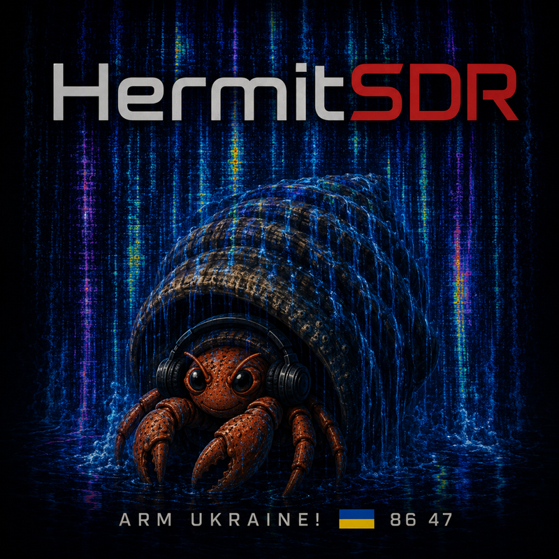

  

# HermitSDR

A native macOS client for openHPSDR software-defined radios —
**Hermes-Lite 2 / SquareSDR** (Protocol 1) and **Apache Labs ANAN**
Orion-class radios (Protocol 2). Built for Apple silicon: SwiftUI +
Metal on the outside, Accelerate/vDSP DSP and a lock-free audio path on
the inside.

This is the **download home** for HermitSDR. Grab the latest signed,
notarized build from the [**Releases**](../../releases/latest) page.

For the complete release history, read the [**CHANGELOG**](CHANGELOG.md).

> **Availability**: HermitSDR is not made available for use in the
> Russian Federation while Russia's war against Ukraine continues. The
> app checks the system region/timezone at startup and declines to run —
> an offline check by design (nothing phones home). Слава Україні. 🇺🇦

Receive *and transmit* are live-proven on **both protocols** (on a dummy
load; on-air QSOs are yours to enable): the Hermes-Lite 2 and the
ANAN-7000DLE MK2 — correct sideband both ways on each, clean key/unkey,
hardware PA interlocks, keyboard **CW keying**, and a complete
**WSJT-X FT8 cycle** validated end to end through CAT PTT.

## New in 2026.0904_002

- **Features catalog:** Station → Features… (⌘⇧F) searches 51 tools and lets
  you show or hide entry points. Requirements and dependencies are explained;
  settings, saved data and ongoing activity are preserved. Reset restores
  visibility without enabling services, AI, decoders or transmit.
- **Logbook workspace:** Log → QSO Log adds ADIF import/edit/export, bulk
  changes, saved filters and automatic backups, tested with 100,000 contacts.
  Its **Awards…** and **World & radar…** buttons open DXCC/WAS/grid analysis,
  an interactive globe, UTC gray line, paths and local DX radar.
- **Waterfall visibility:** palette icon → Dynamic Underlays offers Aquarium,
  Night Garden and Deep Space. Deep Space and Night Garden now have separate
  **Signals over scenery** and **Underlay brightness** sliders, signal colors
  and a **High contrast** shortcut. Scene and marquee settings also open from
  View and the Features catalog. SKIM continues to start off each launch.

## Download & install

1. Open the [latest release](../../releases/latest) and download
   **`HermitSDR-<version>.dmg`** (or the `.zip`).
2. Open the `.dmg` and drag **HermitSDR** to your Applications folder.
3. Launch it. The build is signed with an Apple Developer ID and
   notarized by Apple — the disk image itself is signed and stapled too —
   so it opens without any "unidentified developer" warning.
4. On first launch, grant the **Local Network** permission when macOS
   asks — discovery and streaming need it.

**Staying current is automatic.** HermitSDR checks for its own updates
(**HermitSDR ▸ Check for Updates…**, plus a quiet daily background check
you can turn off) and, when a newer signed build exists, shows you the
release notes and offers a one-click **Install & Relaunch** — it verifies
the download's Apple notarization and developer signature before
replacing itself. You can always come back here and grab a build by hand.

Every release ships with a `SHA256SUMS` file; verify a download with
`shasum -a 256 -c SHA256SUMS`.

## Requirements

- Apple silicon Mac (M1 or newer)
- macOS 15 (Sequoia) or newer
- An openHPSDR radio on your LAN (Ethernet recommended at 384 kHz and
  above): **Hermes-Lite 2 / SquareSDR**, or an **Apache Labs ANAN /
  Orion-class** radio on Protocol 2 firmware (an ANAN-7000DLE MK2 on
  fw 2.2.10 is the reference — fw ≤2.1.18 receives but is not recommended
  for transmit)

## Capabilities

<!-- Mirrors the app's built-in capability table (DSP/Capabilities.swift). -->
| Capability | Support |
| --- | --- |
| Radios | Hermes-Lite 2 / SquareSDR (openHPSDR Protocol 1) · Apache Labs ANAN Orion-class, e.g. 7000DLE MK2 (Protocol 2) |
| RX / TX | Receive + transmit live-validated on both protocols (dummy load; on-air QSOs user-gated) |
| Sample rates | 48–384 kHz (P1) · up to 1536 kHz (P2) |
| Demod modes | USB, LSB, CW, AM, SAM, FM, NFM, DSB · separate wide/narrow FM deviation · CTCSS encode/decode |
| FT8 / FT4 | Receive: waterfall spots, decode panel, stations-heard ADIF (FT4 exported as MFSK/FT4), PSKReporter uploads, 15 s / 7.5 s UTC slots, time-machine replay. Transmit: native slot-clocked modulator + auto-sequencer behind ARM/TXCoordinator (hardware validation pending), or WSJT-X via CAT PTT + audio routing |
| SSTV | Martin M1, Martin M2, Scottie S1, Scottie S2, Scottie DX, Robot 36, Robot 72, PD50, PD90, PD120, PD160, PD180, PD240, PD290 — auto VIS + manual mode/start, slant/phase correction, PNG export |
| WEFAX | IOC 576 · 120 LPM, IOC 576 · 90 LPM, IOC 576 · 60 LPM, IOC 288 · 120 LPM — polarity, slant/phase, crop/rotate, PNG with metadata |
| RTTY | 45.45/50/75/100 Bd · 170/200/425/850 Hz shifts · normal/reverse polarity · bounded AFC |
| CW | Adaptive 8–60 WPM decoder at the 700 Hz pitch · **OmniSkimmer**: GPU polyphase channelizer skims every CW signal across the whole span at once (~375 Hz bins, per-signal decoders, waterfall labels + panel) |
| Spotting | DX cluster telnet client (multiple nodes at once, RBN-ready, waterfall labels + Times Square ticker) · LoTW user badges + TQSL sign-and-upload · PSKReporter uploads · live planetary K-index |
| Logbook | ADIF import/export with preserved fields · editing, bulk changes, saved filters and backups · precise LoTW contact matching · DXCC/WAS/grid coverage · interactive worked-world globe, gray line and local DX radar · 100,000-contact performance fixture |
| Feature catalog | Searchable inventory of 51 tools and surfaces · dependency-aware menu/control visibility · direct settings links · safe visibility reset |
| Extras | Sub-RX (VFO B) · diversity RX (P2) · RF time machine (180 s IQ) with decoder-event replay + excerpt export · IQ record/replay (.hiq) · 3D waterfall + ×2–×8 history compression (~9 min of band activity) · analog multimeter + GPU TX meters · lightning-static watch · hamlib NET rigctl CAT · tuning-device knobs (Ulanzi D100H template, user-remappable with per-control tune steps, off by default) · optional Discord integration (status bot + Opus voice streaming + /waterfall snapshots, off by default) |
| Platform | macOS 15+, Apple silicon only |

## The story so far

**Transmit era.** The full TX audio rack, the complete ANAN feature set
— antenna matrix, ADC dither/random, 768/1536 kHz rates, a 0–61.44 MHz
wideband bandscope, **dual-ADC diversity receive** — a 16-sound
roger-beep portfolio (sorry), a 19-effect voice-FX shelf from plate
reverb to a true Bode frequency shifter (also sorry), the TX diagnostics
window, and the broadcast-processing generation: true-peak lookahead
limiter, phase rotator, gate/de-esser, CESSB, multiband compression, an
Optimod-style AM profile with +125% positive peaks, a two-tone IMD
source, and a live audio-chain map with snap-in rack units.

**Decoder era.** A shared decoder-session layer with an activity window,
fourteen SSTV modes with slant/phase correction, configurable RTTY with
bounded AFC, WEFAX profiles with image recovery, 2G-ALE monitoring,
decoder-event replay through the RF time machine with IQ excerpt export,
the optional Discord integration, and uninstall-proof settings.

**AM broadcast arc.** A TX program file player, the NRSC air chain
(pre-emphasis, RX de-emphasis, platform AGC, 5-band compression,
adjustable positive peaks), **C-QUAM AM stereo** — receive with a
pilot-driven STEREO lamp, and a transmit encoder whose matched
difference chain holds real channel separation through the full
broadcast processing stack (hardware-validated at 35/32 dB L/R) — a
7-band RX graphic EQ, tuning-knob support, and repeated full-codebase
performance sweeps.

**The GPU generation.** An 8192-bin fluid waterfall with a Metal post
chain — phosphor persistence, dual-scale bloom, EDR output brighter than
SDR white on XDR panels, seventeen palettes including two that evolve
with wall time, a 3D heightfield mode with a live-aurora sky driven by
the real planetary K-index, CRT glass, a liquid boundary ribbon, and an
arcade sprite layer (fireworks, achievements, a koi that swims through
the data, and friends). Plus **OmniSkimmer**: a Metal polyphase
channelizer that decodes every CW signal across the whole sampled span
at once.

**Instruments & integrations.** A finely-detailed analog taut-band
multimeter, the GPU TX meters with a phosphor modulation scope, a
lightning-static watch that reads storms off the noise blanker's impulse
detector, DX cluster spotting (multiple nodes at once, waterfall labels,
a Times Square ticker), LoTW user badges + TQSL sign-and-upload, two
visual **skins** (the warm analog "Hermit" look and a flat SmartSDR-style
"Flux Radio"), and a notarized self-updating distribution.

**The operator era** *(current)*. Everything a transmitter control app
owes its operator: a single authoritative **TX coordinator** every key
source passes through (UI, CAT, keyboard, hardware — typed policy,
ownership, latched protection trips), per-radio **calibration catalogs**
with guided power/PA-current fitting against external DC ground truth,
board/firmware **radio profiles** that keep unknown hardware
receive-only, **keyboard CW** and Hamlib CAT Morse through a
sample-clock keyer (live-validated), FM/NFM/DSB with CTCSS, ANAN
**PureSignal** feedback capture and PA characterization with a gated
predistortion trial, a validated end-to-end **WSJT-X FT8** contract,
the **Media Deck** soundboard, **Stream Deck** setup, a software **TX
latency map**, a **Digital Mode Check** doctor, the **Hi-Fi SSB profile
laboratory**, the **Band DVR**, and the **Super Skimmer**.

## Highlights

- **Two radio families, one app**: dual-protocol discovery lists P1
  (HL2/SquareSDR) and P2 (ANAN/Orion-class) radios side by side. The P2
  stack does discovery, streaming at up to **1536 kHz**, NCO phase-word
  tuning, Alex band-pass/low-pass control, an RX antenna matrix
  (ANT1/2/3, EXT1, XVTR, bypass — per-band memory), ADC dither/random,
  the hardware step attenuator, persistent **radio network
  configuration** (static IP or DHCP, written to the radio from the
  connect sheet), and **transmit** — validated live: TX to a
  **selectable ANT1/2/3** jack (the RX routing can never steer the PA),
  drive mapped to the measured PA compression knee, calibrated power/SWR
  metering, and hardware protections (SWR trip, rear-panel TX INHIBIT)
  riding the ANAN's 1 ms TX telemetry.
- **TX safety as architecture**: every key request — click, CAT, CW
  paddle, hardware — flows through one pure, exhaustively-tested
  coordinator with typed refusals, per-source ownership, and protection
  trips that latch until you disarm. Radio profiles resolve board +
  firmware before any PA command is allowed; unknown hardware is
  receive-only. Nothing keys without an explicit ARM, ever.
- **Wideband bandscope** (P2): the entire 0–61.44 MHz raw-ADC spectrum
  in its own window — click to tune, band shading, doubles as a live
  view of the Alex preselector relays.
- **Demodulation**: USB / LSB / CW / AM / SAM (synchronous AM with a
  carrier-tracking PLL) / **FM and narrow FM** (with CTCSS encode and
  decode) / **DSB**, 48–384 kHz spans on P1 and up to 1536 kHz on P2.
- **Sub-receiver**: a second hardware NCO slice (RX2) on VFO B with its
  own panadapter window — split/pileup listening, audio summed with its
  own level. VFO A/B swap, SPLIT, RIT/XIT.
- **Diversity receive** (P2): both of the Orion's phase-synchronous ADCs
  on one frequency, combined as A + w·B with a Thetis-style polar
  steering pad (drag radius = gain, angle = phase) — null local noise
  with a second antenna.
- **Super Skimmer** (P2): the Orion's four spare DDC receivers parked on
  the FT8 sub-bands of **four different bands at once**, each with its
  own decode chain — an all-band spot firehose from your own antenna,
  feeding PSKReporter and the heard map with each monitor's true
  frequency. Receive-only by construction, suspended automatically while
  diversity or PureSignal needs the hardware.
- **Band DVR**: continuous, disk-backed recording of the *entire sampled
  span* with a hard byte budget (2/8/32 GiB by resource preset, oldest
  segments pruned first). A wall-clock timeline in Radio ▸ Band DVR shows
  everything on the shelf — click any moment and it replays through the
  production chain exactly as live: re-tune, re-mode, re-decode the past.
- **RF time machine**: the last 3 minutes of the whole span buffered in
  RAM. Rewind by slider or **⌥-click a waterfall row**, re-tune/re-filter
  the past, replay decoder events from their bookmarks, and export any
  window as a replayable IQ excerpt.
- **Decoders**: in-process **FT8 and FT4** (callsign spots on the
  waterfall + decode panel + ADIF stations-heard export + PSKReporter
  uploads), **SSTV** (14 modes across Martin/Scottie/Robot/PD with
  slant-phase correction), **weather fax** (four IOC/LPM profiles with
  image recovery), **CW**, **configurable RTTY**, and a **2G-ALE
  monitor**. All report through a shared session layer (Decoder Activity
  window) and bookmark themselves into the time machine.
- **CW transmit**: keyboard paddles or Hamlib CAT `send_morse` drive a
  deterministic sample-clock keyer through the TX coordinator — shared
  RF/sidetone envelope, watchdog-guarded, live-validated on the air side
  of a dummy load.
- **Channel filter**: 513-tap complex bandpass run as 1024-point FFT
  overlap-save convolution — −120 dB stopbands, ~100 Hz skirts,
  continuously variable width, independent IF-shift, all click-free while
  you drag.
- **Noise tools**: impulse blanker, spectral-gate NR, **RNNoise ML noise
  reduction** (recurrent network, <1% CPU; press **N** to A/B by ear),
  manual + LMS auto-notch, calibrated squelch, overload auto-mute,
  two-band RX EQ.
- **Panadapter**: Metal waterfall + spectrum, GPU zoom ×1–×8,
  pan-over-span without retuning, averaging modes, adjustable speed, peak
  hold, and an audio-passband mini-waterfall (23 Hz/bin) for precise
  CW/digital placement.
- **Transmit**: 48 kHz mic → profile bandpass → 3-band EQ → compressor →
  voice FX → Hilbert-pair SSB modulator (≥40 dB image suppression) or
  full-carrier AM → per-protocol IQ. Pixel-art TX console with ARM/PTT
  interlocks, TUNE tone, drive, mic meter, live telemetry (PA current,
  watts, FWD/REV, SWR), and a **roger beep** picker — classic plus 14
  deliberately weird ones. CAT PTT keys it from WSJT-X, still behind ARM.
  It never keys without an explicit ARM.
- **Digital modes, properly plumbed**: a processor-enforced **Digital
  TX profile** (voice processing hard-bypassed, channel filters and the
  safety limiter always in charge), a **Digital Mode Check** doctor that
  names exactly what's misconfigured before you key, a validated
  **WSJT-X** CAT + PTT + audio contract, and a read-only **TX Latency
  Map** that itemizes every software delay from microphone to
  packetizer with provenance labels.
- **Per-radio calibration**: a versioned catalog keyed to the physical
  radio + firmware. **PWR CAL** promotes your wattmeter's reading to
  operator-measured truth; **CAL PROFILE** fits the full power and
  PA-current models from guided measurement points (the reference ANAN's
  current detector is fitted against external DC clamp measurements) and
  exports the evidence as CSV/JSON.
- **PureSignal** (ANAN): synchronous PA-feedback capture, delay/gain/
  AM–AM/AM–PM characterization with credible two-tone IMD readings, and
  a strictly-gated memoryless predistortion trial that hard-bypasses
  itself unless the feedback actually improves.
- **TX program source**: Microphone, **Audio file**, or the **Media
  Deck** — a soundboard of local clips and web audio with groups,
  fades, keyboard shortcuts, VoiceOver support, and interlocked routing;
  the file player streams any WAV/AIFF/MP3/AAC/FLAC into the TX chain at
  real-time pace.
- **TX audio rack**: any input device (hot-swaps while armed, with a
  channel picker for multichannel interfaces); fourteen voicing profiles
  from DX SSB and Contest to ESSB Wide, Hi-Fi AM, and the Optimod/NRSC AM
  air chains; an eight-band ±12 dB transmit EQ; **custom profiles** that
  snapshot voicing + EQ + FX under your own name; and the **Hi-Fi SSB
  Profile Laboratory** — record one voice passage, hear two candidate
  profiles loudness-matched A/B through the real chain, with objective
  spectrum/dynamics measurements.
- **Voice effects**: nineteen with an intensity slider — the classic
  shelf (doubler, slap, echo, chorus, room/hall/plate reverb) plus the
  weird ones (Jet Flanger, Phaser, Space Echo, Dalek, Chipmunk, a true
  Bode frequency-shifter Alien, 8-Bit). All causal, zero added latency,
  with an automatic post-FX bandpass so nothing leaves the channel.
- **TX Meters**: a floating diagnostics window — a scrolling
  **modulation scope** with a target zone and a mic-technique coach
  (two-tone tests trace the actual wire IQ); MIC CLIP / FLAT TOP /
  OVERDRIVE / UNDERRUN lamps; the full gain-staging meter rack plus
  PWR / SWR bars and PA temperature/current.
- **Broadcast-grade TX processing**: true-peak lookahead limiter + phase
  rotator + post-limiter band cleanup (always on); optional noise gate,
  de-esser, multiband compression, and **CESSB** controlled-envelope SSB;
  an **Optimod AM Broadcast** profile with +125% positive peaks; a
  **2 TONE** IMD test source; and a live **TX Audio Chain** stage map
  hosting snap-in rack units (Tilt / Warmth / Exciter / Leveler /
  Density).
- **The GPU display**: an 8192-bin FFT waterfall with buttery sub-row
  scrolling and a full Metal post chain — phosphor persistence,
  dual-scale bloom, chromatic aberration, vignette, film-grain **CRT
  Glass** — plus true EDR (hot carriers render *brighter than SDR white*
  on XDR panels), seventeen palettes (two computed live in the shader), a
  **3D heightfield mode** with a draggable camera and a starfield-aurora
  sky that follows the **real planetary K-index**, and an optional
  **Arcade FX** layer (S-meter floaters, prefix fireworks, achievements
  with a trophy case, a koi that swims *through* the data, a rotating
  cast of critters — press **A** to toggle it). Two **skins** restyle the
  chrome and metering: the warm analog **Hermit** look, or a flat,
  SmartSDR-inspired **Flux Radio**.
- **OmniSkimmer**: a Metal compute polyphase filter bank splits the whole
  sampled span into ~375 Hz channels (4096 at 1536 kHz) and a per-signal
  decoder fleet tracks and reads every CW — and probe-qualified RTTY —
  signal at once: per-signal WPM and confidence, green labels with SNR
  health bars, click to tune.
- **RF Vision**: a resource-budgeted signal classifier watches the
  waterfall for CW / FSK / FT8-shaped activity — click a detection to
  tune it, route it to the right decoder, rewind to its first
  appearance, or pin and export it.
- **Ask The Crab**: an optional assistant with on-device and explicitly configured
  provider options, plus radio tools: tune, set
  modes and filters, identify signals, look up schedules and DXCC
  standings, watch for band openings, run an active multi-band **Band
  Scout** sweep and offer ranked tune-tos, and — in OAuth YouTube Live
  sessions — answer viewer questions from chat behind a strict
  reporting-only boundary (viewers can ask what's on the waterfall; they
  can never tune, change settings, or reach TX).
- **Streaming**: optional built-in **YouTube Live** integration — RTMP
  session management, live captions from the decoder fleet, and the
  co-host above — plus Discord voice streaming of the speaker mix.
- **Instruments**: the header S-meter is a Metal shader (LED segments,
  analog ballistics, EDR comet head, boost flames past S9);
  Transmit ▸ Measurements & Checks ▸ **Analog Multimeter** is a finely-drawn taut-band meter with a
  spring-physics needle, peak-drag pointer, and six functions on a rotary
  knob; a **Performance Budget** window shows the app's live memory/GPU
  plan and lets you pick Conservative / Balanced / Maximum.
- **Spotting**: a telnet **DX cluster** client that monitors multiple
  nodes at once (human clusters and RBN skimmer feeds), merges and
  dedupes spots, labels them on the waterfall, and optionally crawls them
  across the bottom as a **Times Square ticker**. **LoTW** integration
  badges spotted calls that upload to Logbook of The World and
  sign-and-uploads any ADIF log through TrustedQSL. A live **Kp chip**
  calls the propagation weather.
- **Advisories**: a lightning-static watch counts broadband impulse
  crashes off the noise blanker's always-on detector — sustained storm
  rates raise a dismissable warning (and an airplane towing a banner,
  because this app is what it is).
- **Integration**: hamlib NET rigctl CAT server on TCP 4532
  (WSJT-X-ready), selectable audio output (BlackHole-friendly),
  PSKReporter uploads, **Stream Deck** offline setup with a rendered
  MK.2 tile preview, tuning-knob devices, and a seven-segment UTC clock.
- **Performance**: the whole RX chain costs ≈0.7% of one core at 384 kHz;
  audio crosses to CoreAudio through a lock-free ring; the GPU owns
  everything per-pixel; and the app holds a formal real-time contract —
  per-boundary cadences, deadlines, and overload behavior, verified by a
  30-scenario benchmark on Apple M4 Pro.

## Technology

For the technically curious — what's actually under the shell:

- **Native everything.** Swift 6 (strict concurrency), SwiftUI chrome,
  Metal for every per-pixel and per-channel job (waterfall, post chain,
  3D mode, polyphase channelizers, S-meter), Accelerate/vDSP for the
  per-sample DSP. No Electron, no Python, no runtime downloads.
- **Two wire protocols, implemented from the spec.** openHPSDR
  Protocol 1 (EP2/EP6 framing, register rotation, sample-count-paced
  pacing) and Protocol 2 (per-DDC UDP streams, NCO phase words,
  high-priority C&C at 10 Hz, DUC IQ at 800 packets/s) — both written
  against the published specs and cross-checked against reference
  implementations, with the firmware quirks documented and pinned by
  tests.
- **A real DSP chain.** Complex mixing, FIR decimation cascades, a
  513-tap FFT overlap-save channel filter with −120 dB stopbands,
  WCPAGC-style AGC, spectral-gate and RNNoise neural noise reduction
  (vendored, BSD-3), carrier-PLL synchronous AM, C-QUAM stereo
  matrix decode/encode, CTCSS, and Hilbert-pair SSB with CESSB envelope
  control on transmit.
- **FT8 the honest way.** The vendored ft8_lib (MIT) provides LDPC(174,91)
  + CRC-14 decode; slot scheduling is wall-clock disciplined; spots ride
  IPFIX to PSKReporter.
- **Deterministic transmit.** One pure TX coordinator state machine
  (11 events × 6 states, exhaustively tested), a sample-clock CW keyer,
  fixed-capacity lock-free queues on every real-time boundary, and a
  release benchmark that fails the build if percentile timings or
  allocator growth regress.
- **Memory that behaves.** The 180 s IQ history lives in one page-backed
  mmap that degrades gracefully under memory pressure; the Band DVR
  prunes itself to a byte budget; Metal textures resize on allocation
  failure. The Performance Budget window shows you the plan.
- **Tested like it matters.** 1,090 package tests (two intentional fixture skips)
  run on every push — DSP math, protocol framing against a deterministic virtual radio
  (drop/duplicate/reorder/truncate/stall faults), decoder fixtures for
  every supported mode, concurrency stress under sanitizers, and a
  docs-consistency gate that fails the build if this capability table
  drifts from the code.
- **Distribution you can verify.** Developer ID signed, Apple-notarized,
  stapled (app inside the ZIP, and disk image), SHA-256 manifests on every
  release, and a self-updater that re-verifies signature + notarization
  before replacing anything.
- **Privacy-respecting by design.** On-device AI and explicitly configured
  providers, opt-in integrations, secrets in the Keychain, and an anonymous daily ping you can turn off (see Privacy below).

## Using it

| Action | How |
|---|---|
| Tune | Click the waterfall (SSB lands the passband on the click), scroll, arrows, drag the red VFO marker (10 Hz), spin the flywheel under the dial, or scrub the readout digits |
| Tune step | Step menu in the tuning row (10–500 Hz or Auto); ⇧ = ÷5 fine, ⌥ = ×10 coarse |
| Decoders | FT8 / SSTV / FAX / CW / RTTY toggles under the mode picker — each opens its window |
| VFO B / split / sub-RX | VFO cluster: A⇄B, SPL, SUB (own panadapter window), RIT popover |
| Enter frequency | Double-click the VFO readout, type MHz |
| Notch a tone | Right-click it on the waterfall or the audio mini-waterfall |
| Rewind time | Clock button (slider) or ⌥-click a waterfall history row |
| Record | Header buttons: raw IQ (`.hiq`) and demod audio (WAV); replay from the connect sheet |
| Band DVR | **Radio ▸ Band DVR**: record toggle, wall-clock timeline (click = replay that moment), budget + shelf accounting |
| Super Skimmer | **Decode ▸ Super Skimmer** (ANAN): pick up to four bands, watch the per-band decode rates and spot feed |
| Band jump / step | Band menu (per-band memory), ◀/▶ 1–100 kHz grid steps |
| Noise / squelch / AGC / EQ | DSP popover; press **N** over the panadapter to cycle NR off/gate/ML |
| FM / CTCSS | DSP popover in FM/NFM: deviation, tone squelch, CTCSS encode |
| Display & skins | Palette icon: color schemes, Dynamic Underlays and their settings, marquee, 3D Waterfall, CRT Glass, Arcade FX (**A**), and skins |
| Transmit console | Pixel-art ACTIVATE TX CONTROLS banner (top center) |
| CW keying | TX Controls ▸ CW setup (keyboard paddles, WPM, sidetone); CAT `send_morse` works too |
| TX meters / mod scope | Gauge button in the TX Controls header |
| Media Deck | **Station ▸ Audio & Streaming ▸ Media Deck**: pads, groups, shortcuts; route behind the interlocks |
| Diversity RX | Gear popover (P2 only): enable + polar steering pad |
| CAT / audio / station | **HermitSDR ▸ Settings… (⌘,)** or gear button; output device stays in the control bar |
| CW skimmer | **SKIM** toggle in the decoder row; panel button beside it |
| RF Vision | **VISION** toggle: classified detections with click-to-tune/decode/rewind/pin |
| DX cluster / LoTW | **Log** menu (clusters, ticker toggle, LoTW badges + TQSL upload) |
| YouTube / Discord | **Station ▸ Audio & Streaming** menu (stream setup, captions, co-host; Discord bot + voice) |
| Instruments | **Radio**, **Transmit**, **Decode**, **Log** and **Station** menus; Multimeter retains ⌘⇧M |
| Feature visibility | **Station ▸ Features… (⌘⇧F)** or Settings → Features… |
| Logbook / awards / globe | **Log ▸ QSO Log**, then Awards… or World & radar… |
| Antennas (ANAN) | RX/TX chips in the header — glance for the live jacks, click to switch |
| Ask The Crab | Crab button in the header — or just ask it to find you something to listen to |
| Check for updates | **HermitSDR** menu ▸ Check for Updates… |

## Keyboard shortcuts

Bindings are remappable under the ⌨ mapping table in Settings. Defaults
include **Space** (push-to-talk hold), **N** (cycle noise reduction),
**A** (toggle the Arcade FX animations), **V** (swap VFO A/B),
**= / −** (zoom), **B** (bookmark the current frequency), and **Esc**
(mute). CW paddles ride the keyboard from the CW setup panel.

## Troubleshooting

- **No radios found** — check the **Local Network** permission, or an
  access point blocking broadcast: use the manual IP field in the connect
  sheet.
- **Choppy audio at 384 kHz** — watch `seq err` in the status bar; busy
  Wi-Fi drops UDP packets. Use Ethernet or a lower sample rate.
- **FT8 decodes but no PSKReporter spots** — set your callsign + grid in
  the gear popover; uploads go out every ~5 minutes.
- **S-meter reads high or low** — it's antenna-referenced via LNA/ATT;
  trim it against a known source with
  `defaults write com.hermitsdr.app sMeterCalOffsetDb <dB>`.
- **ANAN watts look wrong** — run PWR CAL against a real wattmeter, or a
  full CAL PROFILE fitting session; calibration is stored per physical
  radio + firmware.
- **No TX mic level on a multichannel interface** — check the **Ch**
  picker next to the mic device (XLR 1 = Ch 1). macOS offers no safe
  automatic downmix for layout-less multichannel devices, so HermitSDR
  captures exactly one channel by design.
- **Hermes-Lite 2 shows as receive-only** — update to gateware 68 or
  newer; older gateware (and unrecognized boards generally) are kept
  receive-only on purpose.

## Build lifecycle

Development builds expire: 30 days after its release date a build stops
**transmitting** and runs receive-only, asking you to download the
current one; at 90 days it stops entirely. This is a transmitter control
app under active development, and stale builds can carry known TX
defects onto the air — but a stale build should never take your
*receiver* away mid-net, so it doesn't. Your settings, logs, and
recordings are never touched by an update.

## Privacy

HermitSDR sends one anonymous usage ping per day (turn it off in
**Settings ▸ Privacy**): a random install ID, the app version, the macOS
version, and the CPU type — nothing else, ever. The receiving server
additionally records the connection's IP address, as every web server
does, and derives a coarse country from it locally; no third-party
analytics are involved. No callsigns, frequencies, audio, or radio data
ever leave your Mac unless you enable an integration that exists to send
them (PSKReporter spotting, DX cluster posting, LoTW upload, Discord,
YouTube Live) — each is off by default and scoped to exactly its job.
Ask The Crab can use on-device or explicitly configured providers; selected
cloud providers receive submitted prompts/audio. The "Check for Updates" feature
contacts GitHub to read the public releases list — the same data this
page shows.

## What's next

On-air work is operator-gated, not code-gated: the first on-air QSO,
with the **native FT8 transmit engine** implemented, live multi-band validation
of the Super Skimmer, a two-antenna diversity null test, and ear/eye acceptance for the newest decoders. On
the feature side: PureSignal predistortion beyond the gated trial,
physical Stream Deck hardware, the experimental lab modes on the CASCADE
modem, and whatever GPU eye-candy strikes the mood.

---

Built by **WU1T**. Questions and bug reports are welcome on the
[issue tracker](../../issues).

> **A note on the "Source code" links under each release:** GitHub adds
> those automatically and provides no way to remove them. Here they are
> **intentionally empty** — every release tag points at an empty commit.
> HermitSDR's source code is not published; the real downloads are the
> notarized `.dmg` / `.zip` app assets above them.
