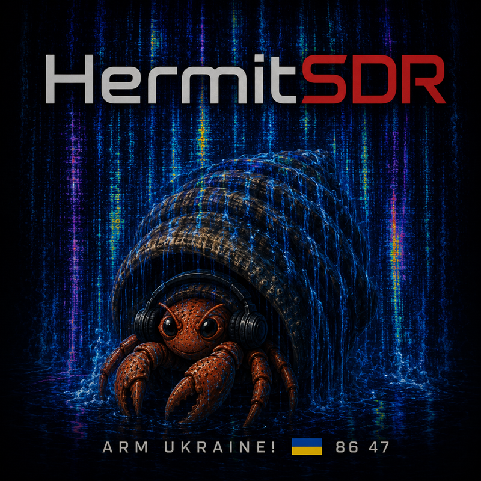
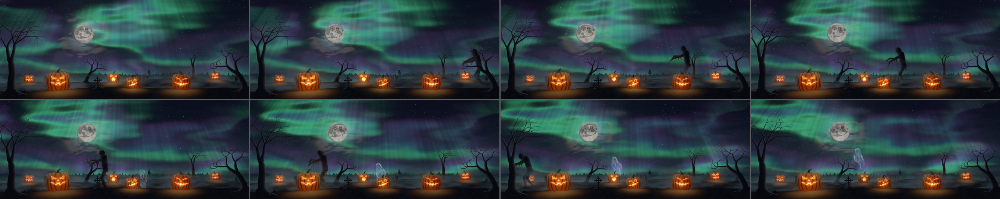

  

# HermitSDR

A native macOS client for openHPSDR software-defined radios —
**Hermes-Lite 2 / SquareSDR** (Protocol 1) and **Apache Labs ANAN**
Orion-class radios (Protocol 2) — plus the receive-only **RFSpace
NetSDR**. Built for Apple silicon: SwiftUI +
Metal on the outside, Accelerate/vDSP DSP and a lock-free audio path on
the inside.

This is the **download home** for HermitSDR. Grab the latest signed,
notarized build from the [**Releases**](../../releases/latest) page.

For the complete release history, read the [**CHANGELOG**](CHANGELOG.md).

The **console layout** is the default since 2026.0927_001: dense
instrument-style receiver and transmitter banks beside a dominant waterfall,
a choice of interface palettes, and a bottom workspace. Aether Dark is now the
default for fresh settings; existing palette preferences are preserved. The classic layout is still
there under View → Appearance → Console Layout (untick it).
The [UI design brief](docs/UI_DESIGN.md) and
[implementation roadmap](docs/UI_IMPLEMENTATION_ROADMAP.md) describe the goal.

> **Availability**: HermitSDR is not made available for use in the
> Russian Federation while Russia's war against Ukraine continues. The
> app checks the system region/timezone at startup and declines to run —
> an offline check by design (nothing phones home). Слава Україні. 🇺🇦

Receive *and transmit* are live-proven on **both protocols**, and the first
on-air QSOs are in the log (WU1T ↔ KA3MAJ, W8NGA, KN1B and KJ5DZV, FT8, 40 m, 2026-09-14/15): the Hermes-Lite 2 and the
ANAN-7000DLE MK2 — correct sideband both ways on each, clean key/unkey,
hardware PA interlocks, keyboard **CW keying**, and a complete
**WSJT-X FT8 cycle** validated end to end through CAT PTT.

Current version: **2026.1010_002** (see [CHANGELOG.md](CHANGELOG.md)).

## New in 2026.1010_002

- Remove the Media Deck's fixed 180-second Auto PTT cutoff (#205) so long videos,
  streams and loops continue until playback stops or normal transmitter
  controls/protections release the key. Preserve refusal and external-unkey
  blocking; regressions cover one hour of simulated playback and release.
  Update the Auto PTT tooltip and pad-editor routing guidance to match.
- Flatten Speaker Tracker assignment and cluster-merge menus (#206) into native
  sections, avoiding the in-window submenu pointer-loss defect. Keep the
  existing actions and identify each destination explicitly. Anchor short
  transmission lists to the top while retaining horizontal scrolling.
- Keep Media Deck toolbar toggles and Keyboard Shortcuts binding buttons on
  the active palette during live palette changes, using the window's observed
  skin owner rather than rereading saved or launch-override settings (#160).
- Put Media Deck edit-mode page tools on a separate compact footer row so
  Rename/Delete/Export/Import labels do not wrap into vertical characters in
  narrow windows (#160). Empty pad outlines also use the active theme border
  instead of white, preserving visible pad boundaries in Light.
- Include console Keyboard Shortcuts and Waterfall Capture controls in both
  full and compact banks (#202).
- Correct amplifier bridge 1.1 documentation: monitoring is the default;
  explicit control enables verified Operate/Standby, and Tune/Set band remain
  refused. Document the unauthenticated control exposure and fixture-only
  validation accurately. Retain physical acceptance and optional native SPE
  work in #207 when closing the delivered #190 protocol/bridge alternative.
- Correct release/agent guidance to match the existing strict VirusTotal gate:
  missing keys and unscanned verdicts stop publication.
- **Verified download.** Developer ID signed, notarized and stapled. VirusTotal reported 0/75 detections for the DMG, SHA-256 `0eb6a5fc88485f53092e1c3aa80791ff7337f73be4e45344a3142a36d43b15c1`.

## New in 2026.1009_003

- **Media Deck audio reaches the transmitter.** Auto PTT sends YouTube and local pads directly to TX, including when speaker output is muted or the pad uses the stream route. Pad effects and gain remain active, and your previous input returns afterward. ARM and transmit interlocks remain in place.
- **The latest YouTube typing fix is included.** Embedded website input keeps its keyboard focus, so typing no longer triggers radio shortcuts.
- **Routing guidance is updated.** The [Media Deck guide](docs/MediaDeck.md) explains the direct transmit route and macOS audio permissions.
- **Verified download.** Developer ID signed, notarized and stapled. VirusTotal reported 0/75 detections for the DMG, SHA-256 `e906fdfc3309c25237370eb3c1fa158f5c1e00a3e37797e98c6c007f3eb7fb2f`.

## New in 2026.1009_002

- **Typing in embedded websites no longer triggers radio shortcuts** (#203). YouTube sign-in could lose the letter A to the Arcade FX shortcut, along with other configured shortcut letters. The keyboard manager now recognizes WebKit's internal editor through its view/responder ancestry and lets the website handle its keys. Native text editing stays protected, radio controls retain their shortcuts, and release of an already-held key still takes precedence over focus changes.
- **Verified download.** Developer ID signed, notarized and stapled. VirusTotal reported 0/75 detections for the DMG, SHA-256 `fa4365668f5d2516490fdcd4d2b36e30cbe4cd41f8eb826f81b1e1a0b7eb20f9`.

## New in 2026.1009_001

- **Roger beeps now work in FM and NFM** (#199). The beep uses the configured FM deviation and pre-emphasis, retains the CTCSS tone when enabled, and keeps the carrier continuous from voice into beep before unkeying. Existing SSB/AM behavior and transmit protections remain unchanged.
- **Verified download.** Developer ID signed, notarized and stapled. VirusTotal reported 0/75 detections for the DMG, SHA-256 `4693852f384ad55bc6f6b4dcea866ead987a107403d4467fc1efee5484736905`.

## New in 2026.1008_001

- **Bookmarks stay reachable in every Console Layout** (#198). The full and compact console banks now carry the Bookmarks star, and Radio → Bookmarks… (⌘⇧B) opens the saved list in any layout. Switching layouts never deleted saved frequencies; it hid their entry point. The shared control exposes the bookmark count to accessibility.
- **Warning toasts remain readable in the Light palette.** PA thermal notices and Crab watch alerts use white text on their fixed dark overlay, instead of inheriting dark primary text from Light appearance. Bookmarks and the thermal threshold popover use the shared palette and their own colour scheme, so their text remains readable beside the dark instrument header. The PA temperature chip keeps its single-line width beside the classic TX banner rather than collapsing into a narrow vertical strip.
- **PA temperature and current on the main panel** (#200). A Hermes-Lite 2 shows its PA temperature and drain current under RF Pwr / SWR, live during receive; an ANAN Orion MkII shows current only because its status packet has no temperature sensor. Missing samples and current below the conversion's trust floor show “—”.
- **Configurable HL2 thermal warning** (#200). Temperature turns amber at an adjustable threshold (default 50 °C) and red at 55 °C, with a one-time session warning and a temperature chip beside the TX banner while warm or hot. The warning labels 55 °C as an operator-reported cut-off that has not been verified. These readouts only inform the operator; they do not key, unkey, inhibit or throttle the transmitter.
- Clarify the source and limits of the thermal thresholds, and update the engineering handoff with release validation and the remaining operator acceptance checks.
- **Verified download.** Developer ID signed, notarized and stapled. VirusTotal reported 0/75 detections for the DMG, SHA-256 `07e88fe4ad5b0799d70af69f0300559986a473a8e6c4c9f7e8a35068b3156bca`.

## New in 2026.1007_003

- **Every ANAN on Protocol 2 is now recognised by name and receives through its Alex relays** (after #197, for #196). ANAN-10/100 (Hermes, board 1), ANAN-10E/100B (board 2), ANAN-G2 (Saturn, board 10) and an Atlas/Metis backplane (board 0) no longer fall to "Unknown P2 Board", whose fallback never sent an Alex word — the likely cause of K6AVP's "band active, no decodes" on his ANAN-100B (#196). Hermes-class boards get the single classic Alex word with their receivers on DDC0/1; the G2 gets the Orion MkII's two-filter-board words. Transmit stays closed on all of them until a dummy-load session validates it.
- **The reduced-firmware ANAN-10E/100B keeps everything optional off**: one receiver, no sub-RX, monitors, dither or random, and no mid-stream configuration resends.
- **Protocol 1 Hermes, Griffin, Angelia, Orion and Orion MkII boards are named in the connect sheet** with their ADC count, still receive-only: the Protocol 1 stack sends no Alex bytes, so their filters and antennas are not driven yet, and the row's hover says so.
- **Byte-identical guarantee for the validated and reviewed boards.** Full-packet hashes of the Orion MkII, Orion and Angelia General, DDC-specific and High-priority packets are pinned by test, recorded on the previous release's tree with a settle wait (the first recording captured whichever of the General or the High-priority packet landed first and flapped between boards from run to run) and reproduced on this one; the loopback virtual radio now streams a second receiver from DDC1 for DDC0/1 boards.
- **Verified download.** Developer ID signed, notarized and stapled. VirusTotal reported 0/75 detections for the DMG, SHA-256 `1ec853c2de8f46f455391bf5f81286173e07fb7fd39043064efca71c07995bee`.

## New in 2026.1007_002

- **YouTube clips play in the Media Deck mix, alongside wav pads.** A YouTube pad's audio is now tapped from WebKit's media process (a Core Audio process tap, muted at the source so nothing is heard twice) into the deck's own graph, so pad gain, the FX rack, the output device, "Send to stream mix", the deck meter and the TX App-audio source treat it exactly like a local pad — and a wav pad plays at the same time in the same mix. macOS asks once for System Audio Recording on the first YouTube play; refuse it and the clip plays to the speakers as before, and the pad, the player panel and the pad editor say "speakers only" with the reason. The tap exists only while a YouTube pad is active and is never created at launch. Nothing is downloaded or cached.
- **The YouTube player is a panel, not a sheet.** It sits under the pad grid, serves every YouTube pad (pressing another swaps the clip) and leaves the grid fully usable while a clip plays.
- **YouTube pads play again.** The embedded player had started refusing every clip with error 152 (embed origin); the deck now embeds from its own page origin, and every public clip tried plays.
- **ANAN-200D (Orion) and ANAN-100D (Angelia) are recognised and receive through their Alex relays** (#197). An operator's ANAN-200D on Protocol 2 firmware 1.9 showed up as "Unknown P2 Board (receive only)" and connected to white noise with no relay clicks on a band change: only the Orion MkII (board 5) had a profile, and the unknown-board fallback never sends an Alex word, so the Alex RX input and filter relays never closed. Boards 4 and 3 now take a reviewed receive profile with the single Alex board's word — RX high-pass and low-pass filter for the band, ANT1/2/3, EXT1, XVTR and bypass inputs — and one General latches each change, so band changes click relays as in Thetis. Transmit stays closed on both boards until a dummy-load session validates it; the connect sheet now reads "RECEIVE ONLY (transmit not validated on this board yet)" and hovering the row shows the resolver's reasoning. The loopback virtual radio now advertises a board type and firmware, and a new suite pins board resolution, the Alex bytes for every topology across seven bands and three inputs, an end-to-end connect against a virtual ANAN-200D, and byte-identical Orion MkII packets.
- **NetSDR clock calibration no longer refuses a fading WWV carrier, and no longer mistakes the receiver's own clock for WWV** (#142). Measured live on MC000359 on 2026-10-07: WWV 20 MHz arrived 45 dB over the noise but faded 6–16 dB between the halves of the 8 s capture, so the amplitude-steadiness gate refused it although its frequency held to 0.16 Hz across fifteen windows. The gate now asks whether the two halves of the capture agree in frequency (within 0.5 Hz; the real 20 MHz capture differed by up to 0.42 Hz between halves) and each still shows a carrier; the amplitude ratio is only the fallback for a capture too short to split. The same session found the NetSDR hears its own 80 MHz clock at 10 and 20 MHz (80 MHz ÷ 8 and ÷ 4) at 26–35 dB over the noise, exactly on the dial with no fading, and the 10 MHz "measurement" had locked onto that spur rather than the real WWV 62 Hz away. Those references are labelled "(clock spur)" in the picker, a measurement that lands on one is refused with the reason, and the default reference is WWV 15 MHz. The refusal text now names what fell short (dB over the noise, half-capture disagreement, a missing half). The measurement also recentres the span on the dial first: with the span centred on the reference, the NetSDR's DC spike sat at exactly 1 kHz in the audio, where the WWV tone is expected, and the two halves of a capture flipped between the spike and WWV ("disagree by 94.25 Hz"). **Validated end to end on MC000359 the same day:** WWV 15 MHz read +94.5 and +94.8 Hz (+6.3 ppm) on two runs, the write stored 79,999,494 Hz and read it back, and afterwards WWV 15 MHz read +0.29 Hz and WWV 25 MHz +0.79 Hz (0.02–0.03 ppm). The write stays behind its confirmation and the hidden unlock key for this release.
- **CHU is no longer offered as a frequency reference.** Canada's CHU time signal left the air for good in 2026, so the NetSDR clock-calibration picker lists WWV only (WWVH shares those frequencies) and the Settings button reads "Measure against WWV". Operator fact from Damon, 2026-10-07.
- **Verified download.** Developer ID signed, notarized and stapled. VirusTotal reported 0/75 detections for the DMG, SHA-256 `99088ad79ffbaa6370d6abf18f79ac307df81b6776886ff313a0647071b652c4`.

## New in 2026.1007_001

- **Light palette reaches every auxiliary window** (#160). Yesterday's Light palette was only seen on the main console. All 58 catalogued windows were opened and captured in Light, and one defect explained dozens of symptoms: the shared window chrome and seven views still pinned a dark colour scheme from before Light existed, so secondary labels, placeholders, native pickers and text editors came out near-white on paper in TX Controls, Performance, Digital Mode Check, MAGNET, RX EQ, Multimeter, Speaker Tracker, Discord, Viewer Chat, About, Provide Feedback, QSO Log and others. Windows now take their colour scheme from the palette; unlit LED segments, image borders, hover washes and Media Deck page tabs use a palette-aware lift instead of white-on-dark alpha. TX Meters and the console tuning strip stay black-face instruments by design.
- **RTMPS: a refused certificate now reads as a TLS failure, not a missing route** (#157). Network.framework reports a rejected server certificate as a *waiting* state; HermitSDR logged "No network path … Still trying…" and then timed out twenty seconds later blaming TCP, so a wrong `rtmps://` host, a proxy or VPN intercepting TLS, or a bad edge certificate on Kick or Facebook Live would have been chased as a firewall problem. The log now says "TLS connection failed" at once with a certificate hint, and the reconnect ladder still re-dials. Found by the new loopback RTMPS fixture; the real Kick/Facebook edges remain a live check.
- **Vendored RNNoise contracts made explicit, analyzer clean** (#164). The built-in model's dimension and activation contract and the pitch/LPC helpers' argument contracts are now stated in the vendored sources (`rnn_model_is_supported`, an `rnnoise_init` that refuses an unsupported model, `celt_assert`s that are live for the static analyzer and in the invariant fixture, call-site `_Static_assert`s). The deliberate null writes for unsupported activations, which clang silently deleted as undefined behaviour, are now real traps. Clang analyzer reports in the vendored DSP went from ten to zero, and the noise reducer's output is bit-identical before and after (2,000 frames fingerprinted). The shipped app compiles the assertions out exactly as before.
- **A port collision no longer takes the whole DSP test bundle down.** `KenwoodCATTransportTests` now retries its random loopback port, listens for the server's failure event, and fails the one test instead of trapping on an empty peer list (CI run 37520009662 on a docs-only commit crashed xctest with signal 5).
- **MIDI controllers light their pads** (#127). A pad mapped to a band, mode, NB/NR/ANF, mute, split, dial lock, antenna, tuning step, bookmark or Media Deck clip can now echo the radio's state to the controller's LED: switch **Lamp** on in the row (Station ▸ Control Devices ▸ MIDI Controller) and set the velocity the controller reads as colour. Only changes are sent, nothing goes out while MIDI is off or at an idle launch, every lit lamp is darkened on disable, quit or unplug, and a re-plugged controller is relit. PTT, TUNE and MOX never light — a pad is not an ON AIR indicator. Seen with a virtual controller only; no physical LED panel yet.
- **MIDI 2.0 controllers decode to the same controls** (#127). CoreMIDI already converts them for the input port; a 2.0 channel-voice word that arrives anyway now decodes to the same note/CC/wheel events, scaled to 7 bits, so Learn and the mappings behave identically.
- **Lamp output goes only to the controller it came from** (#127). Lamp messages are paired by name to a connected source (or the source filter); a synth on the same Mac never hears the radio, and a controller whose input vanished is not relit through its lingering output.
- **Spectrum averaging and waterfall speed now follow the radio** (#171). The per-radio receive profile gains the averaging mode (Fast/Med/Slow/Peak) and waterfall rows/s, so an HL2 at 48 kHz and an ANAN at 1.5 MHz each keep the display dynamics you tuned for them. A profile saved before this release keeps your current setting on first reconnect rather than resetting it, and fills in from there.
- **NetSDR front-end choices are remembered per receiver** (#171). RF 1/RF 2 jack, preselector, A/D dither and the +1.5 dB gain step now live in that NetSDR's profile instead of one shared setting; a second NetSDR no longer inherits the first one's jack. The radio still only receives these in the connect sequence, and RF 2 still waits for the X2 confirmation.
- **Verified download.** Developer ID signed, notarized and stapled. VirusTotal reported 0/75 detections for the DMG, SHA-256 `d975e3ad94aa309ead790eaa9c3c0a4d2f40512c1675f1d8c26ff4d38c66dcb6`.

## New in 2026.1006_004

- **"Configure ANAN Network" no longer leaves you staring at "Command sent"** (#196, K6AVP's first-run report on an ANAN-100B). Protocol 2's set-address command has no acknowledgement, and the sheet said so only by sitting there with a Cancel button. It now watches the rescan for the same board answering discovery again — at the requested address for a static write — and says so with a Close button; after 25 seconds without an answer it says plainly that no acknowledgement is expected, suggests Rescan, and names the case where the radio's firmware does not implement address changes (some reduced Protocol 2 builds, the ANAN-100B among them), so the operator knows to use the manufacturer's tool instead of waiting.
- **FT8 / FT4 say when they are paused** (#196). The decoders only run in USB — the tooltip said so, but a lit FT8 key in another mode decoded nothing in silence. The decoder row now shows "paused · needs USB" beside the keys whenever FT8 or FT4 is on and the receiver is not in USB. (The operator's "band active, no decodes" has not been reproduced; this is the one thing the app could have told him at the time.)
- **TCI server can accept clients from other machines** (#196). Settings ▸ CAT ▸ "Allow TCI clients from other machines on this LAN" binds every interface instead of loopback, so WSJT-X or a logger on another computer can connect to ws://<this Mac>:port. TCI has no pairing step, so the setting's note says what that means: anyone on the LAN who can reach the port can tune the receiver and hear its audio. Transmit commands stay refused whatever the source. Off by default; the status line names the binding.
- **A Light palette** (#196, "dark mode too hard on eyes — need a normal lite mode"). "Light" joins the palette menu beside the dark skins: paper-grey surfaces, ink text, one blue selection accent, meter and state colours darkened to read on light ground, and the native appearance switched to Aqua for that skin only so menus and popovers follow. Dark remains the default and nothing about the existing palettes changed. Instrument faces that are black by design (the header strip with the dial, S-meter, clocks and power meters; the waterfall; the branded About and update panels) stay black. Seen on screen in Demo Mode: light sidebar, control bank and status bars around the black instruments. Debug builds take `HERMITSDR_SKIN=<palette name>` for screen checks.
- **Verified download.** Developer ID signed, notarized and stapled. VirusTotal reported 0/75 detections for the DMG, SHA-256 `4c991665cd6c288d579f0e4e23d5782a5c44d061d2bad53d7d5249363ee14d00`.

## New in 2026.1006_003

- **SPE Expert: Operate and Standby from HermitSDR** (#190). `tools/expert-amp-bridge.py` 1.1 gains `--allow-control`. Expert Amp Server only offers the amplifier's OPERATE key, which toggles, so the bridge turns the protocol's absolute OPER and STBY into a verified toggle: it reads the amplifier's state fresh, presses the key only if the state differs, waits a second (`--control-settle`), reads back, and answers OK only when the amplifier reports the requested state; one retry if nothing moved, never more than two presses, and any other outcome is an `ERR STATE` naming what the amplifier reports. OPER is refused while the amplifier reports an alarm; TUNE and BAND stay refused. The Operate and Standby buttons in Station Devices then work; keying is unchanged (the radio's PTT line keys the amplifier, never the bridge). Checked against the bridge's built-in fake server only (self-test 65 checks); not yet run against Expert Amp Server or a 2K-FA.
- **After an unexpected quit, HermitSDR offers to send the crash report** (#195). If the previous run never reached the quit path and macOS wrote a crash report for this app since, the next launch shows a sheet: the exact text that would go to the feedback inbox (app and macOS versions, the fault, the crashed thread's stack, other threads' HermitSDR frames, and the app's binary image; register state, instruction bytes, the VM summary, code-signing details and the crash-reporter key are left out, and the home folder and user name are replaced wherever they appear), an optional note and email, and Send or Don't send. Nothing is sent automatically, a report is offered once whatever the choice, reports older than two weeks are never offered, and "Don't offer to send crash reports again" is remembered. A force quit or a power loss leaves no crash report and so no prompt. Sending goes through the same delivery centre as Provide Feedback, so the retry outbox applies. The digest is built by a pure function with package tests against a sanitised real report; the sheet and the launch check have been compiled only. Debug builds accept `HERMITSDR_CRASH_FIXTURE=<file.ips>` to show the sheet from a file.
- **Verified download.** Developer ID signed, notarized and stapled. VirusTotal reported 0/75 detections for the DMG, SHA-256 `c9d3e6e07e6f84297119f82dbc3c32d5ff6fbb66a210a6e25ca8baa88129ae8b`.

## New in 2026.1006_002

- **NFM receive: the CTCSS tone is no longer heard as hum** (#193, reported through the website inbox: "can you fix HUM come with CTCSS in receive NFM mode?"). A repeater's sub-audible access tone (67–254.1 Hz) rode the discriminator output under every over, and nothing after the detector removed it. Worse, the de-emphasis is flat below its 300 Hz corner and unity at 1 kHz, so the tone left the speaker about 10 dB louder relative to speech than it was sent — in the loopback fixture a tone at the usual 15 % of deviation came out at twice the amplitude of a 1 kHz program, loud enough to push the AGC-off limiter into compressing the voice. The FM and NFM speaker audio now passes a sub-audio filter: a sixth-order Butterworth high-pass cornered at 300 Hz (flat to ±0.2 dB from 500 Hz up, −3 dB at the corner, 67 Hz down 75 dB, 100 Hz down 55 dB, 150 Hz down 34 dB, 203.5 Hz down 18 dB) plus a 12 Hz-wide notch that follows whichever tone the CTCSS detector has locked onto, which takes care of the 203–254 Hz tones that sit just under the corner where the high-pass alone only manages 8–12 dB. The detector keeps hearing the unfiltered audio, so the Detected tone readout is unchanged; every non-FM mode is byte-identical. The toggle "Filter sub-audible tones" sits with the FM controls in the DSP popover, on by default and saved with the other FM preferences (a configuration saved before this release decodes with it on and keeps its deviation and tone choices). Checked through the production transmitter and receiver chains: NFM with a 100 Hz tone and a 1 kHz program — tone down more than 40 dB, program within 3 %, detector still reports 100.0 Hz. **Not yet heard on a repeater.**
- **Stream Deck: Bookmarks on keys, fixed-amount tuning and a tuning-step key** (#194, asked for through the website inbox: "Please add/mapping frequencies from MEMORY to a Stream Deck pad. Too please add tunning step 1kHz (there is only 5/10 kHz)"). The key editor's action list gains three groups. *Bookmarks* lists the operator's saved Bookmarks (the app's memories) by name, frequency and mode; the key recalls one with its stored filter and RF settings, shows its frequency, lights when the dial is within 50 Hz of it in the same mode, and reads "missing" if the bookmark was deleted (the press is refused with a receipt rather than tuning somewhere else). *Tune by a fixed amount* moves the dial by ±100 Hz, ±1 kHz, ±5 kHz, ±10 kHz, ±12.5 kHz or ±25 kHz regardless of the console's tuning step — until now the deck's UP/DOWN keys only moved by whatever step the console had selected, Auto by default, which follows the zoom and can land on 5 or 10 kHz at wide spans. *Tuning step* sets the console step itself (Auto, 100 Hz, 1 kHz, 5 kHz, 10 kHz, 12.5 kHz, 25 kHz) and lights when that step is selected, so the existing UP/DOWN and ×10 keys can be put on 1 kHz from the deck. Both tuning actions honour the dial lock like the existing step keys. Existing layouts decode unchanged. The editor still owns no radio: the bookmark list reaches it through the live-state snapshot the radio installs on the device controller, and without one the group is simply empty.
- **Verified download.** Developer ID signed, notarized and stapled. VirusTotal reported 0/75 detections for the DMG, SHA-256 `bd058cb77714e487087cfa47e9a2d36fd6ef91a708583635be1019a4aa49b929`.

## New in 2026.1006_001

- **Binaural CW** (#136, the half left open when the audio peak filter shipped). A "Binaural CW" toggle and a Spread slider sit under the CW peak filter in the DSP popover, CW mode only. With headphones on, each tone's place between the ears follows its pitch: a station on the 700 Hz pitch sits in the middle, one above it toward the right, one below toward the left, and band noise spreads out instead of piling up in the centre. The model is an interaural phase that is linear in frequency and zero at the pitch (−2π·τ·(f − 700), τ = 1/(4·spread)); Spread is how far off the pitch a tone must be to reach the edge of the field (±90°), 50–400 Hz, 150 Hz by default, and twice that far it wraps round to the other side, so set it near a quarter of the filter width. Each ear is one 255-tap FIR with the closed-form response of a fractional delay plus a Hilbert phase rotation; both ears are flat to ±0.3 dB from 300 Hz to 3 kHz, the phase law holds to ±1.5° across the field, L + R at the pitch is the mono signal to −40 dB, and nothing adds DC — all pinned by `BinauralCWTests`. It runs on the final speaker mix only (sidetone and sub-receiver audio included), so the CW decoder, skimmer, recorder, Discord and YouTube keep the mono audio exactly as before; off, the speaker path is the mono ring and node it always was, byte for byte. Saved with the other settings and in the per-radio receive profile (older catalogs decode with it off). **Not yet listened to:** this was built and pinned on synthetic tones and noise only — the stereo image, how it sits with the peak filter, and the hand-over when switching it on (the mono ring plays out what it holds while the stereo ring primes, as the wide AM path already does, with the usual 60 ms duck over the edge) all want a headphone session on a CW band.
- **PA Linearity reads IMD7 beside IMD3 and IMD5, and says which figures are real** (#182). Each product is checked against the noise around its own bin; one that clears it by 6 dB shows as a measurement, one that does not shows as a bound such as `≥ 63.4 dBc` with an orange "floor limited" note, and one the capture cannot resolve (clipped feedback, no two-tone, products outside the captured bandwidth) shows a dash and the reason. The `≥` stays with the number in a fixed-width cell, so a bound can never be mistaken for a measurement and the rows do not shift as readings change. A short line under the table explains the dBc convention (suppression below one fundamental, from the PA-feedback ADC). Nothing about correction changed: a floor-limited IMD3 still cannot fit or judge a candidate, and IMD5/IMD7 are diagnostics only. Checked on synthetic two-tones with a known third/fifth/seventh-order polynomial (within 0.1 dB of the analytic 25.7 / 45.3 / 71.2 dBc) and on clean pairs, which read as bounds at every noise level tried; no radio was keyed and no live IMD accuracy is claimed.
- **Control API smoke: the CI stall was the smoke waiting for a Python client that had already exited** (#141). The only Control API failure since the 2026-09-29 close-ordering fix was the 2026-10-04 run that the wrapper killed at its 180 s limit having printed nothing. The step's own timestamps (killed 183 s after the step began, when the plain pass starts 4 s in and the sanitizer pass only 33 s in) show it was the **plain** pass that stalled, not the Thread Sanitizer pass the issue blamed, and nothing in the fixture can wait that long on its own — every reply budget is 3 s (12 s under the sanitizer) and a failed check exits at once — so the process itself had stopped. The smoke now arms a stall watchdog: after 120 s it names the last stage, samples every thread of its own process with `/usr/bin/sample` and exits with status 3. On its first outing it caught the stall on the runner Mac (plain pass, TLS phase, 111 s with no progress): the main thread idle, and the one busy thread inside `Process.waitUntilExit` for the Python reference client, whose output pipe had already reached end of file and whose process was already gone. The smoke reads the client's pipe to EOF and only then waits for exit, so the child dies in the same instant the wait begins, and `waitUntilExit` — which spins the calling thread's run loop until Foundation's termination source wakes it — never returns. The wait is now two steps that cannot miss an exit that has already happened: poll Foundation's `isRunning` for up to 2 s after EOF, then reap the child directly with `waitpid`. Every deadline in the fixture is also measured on the monotonic clock instead of `Date()`. No threshold, timeout or check was loosened. Counts on the runner Mac while another worker's `swift test` was running (load average 9–35): before the change 41 runs of the two passes (both run the same client wait) produced 1 stall — the Thread Sanitizer pass itself went 10/10; after it the sanitizer pass went 15/15 through the script and the bare plain binary 120/120, with the `waitpid` fallback never needed and no run slower than 12 s. The bare wait pattern alone did not stall in 6,000 rounds on a trivial child, so the exact lost step is not pinned; the new wait depends on neither the run loop nor the termination event. Along the way the issue's other suspects were ruled out again: 300 consecutive refusals under 16 CPU spinners lost none, the strike book saw `127.0.0.1` on every connection, and the plain pass survived a file-descriptor limit of 32 (a launchd service such as the runner starts with 256).
- **Header, record bank and status bar labels hold their width.** The same fault as the ADC OVF lamp in 2026.1005_006, found by reading every state-changing label in the console: the header's TX button grew from "TX SAFE" to "TX ON AIR" on every over and moved the antenna chips, Kp and the gear button both times; the Record bank's REC latches became "STOP 0:00" when recording started and pushed the folder button sideways; the legacy header's recording timers grew at ten minutes; and the status bar's CPU, GPU, frame-time, packet-rate, throughput and sequence-error readouts each moved everything left of them whenever a number gained a digit. Each of these is now a `HeldWidthText`: sized for its widest value, so the control around it never changes size. The TX window's telemetry cells, clip timer and status lamp already had fixed widths and are unchanged.
- **Verified download.** Developer ID signed, notarized and stapled. VirusTotal reported 0/75 detections for the DMG, SHA-256 `b8f94bff0a807608d804b8c87146b3073034f06a422887091d665e4ad18aa462`.

## New in 2026.1005_006

- **The ADC OVF indicator no longer shoves the header controls around** (reported by Damon with a screenshot of the strip "glitching like crazy"). The chip was added to the header row only while the radio's overflow flag was set, and a radio near clipping reports that flag on and off many times a second, so every edge inserted or removed about 60 points and moved the bandwidth toggle, Ask the Crab and Provide Feedback sideways. ADC OVF is now a lamp with a permanent slot between the connection button and the bandwidth toggle: dark and dim while the converter is clear, red while it clips. Lit, it pulses twice a second with a soft halo and throws small yellow and orange sparks from its edges; the pulse and sparks are drawn in an overlay that takes no layout space and stays inside the header row. The lamp stays lit for 0.6 s after the last overflow report, so packet-rate flicker reads as one steady burst instead of a strobe. With Reduce Motion on it lights without the pulse or sparks. It has a hover tip and an accessibility label and value. The overflow flag itself (Auto gain back-off, the Control API's `overload` field) is unchanged.
- **Verified download.** Developer ID signed, notarized and stapled. VirusTotal reported 0/75 detections for the DMG, SHA-256 `52fd6f822119404797387f77d4d57cab82c5c57a5e834b9a44632a7696a3ae52`.

## New in 2026.1005_005

- **Haunted Hollow, second pass.** The moon is now a proper lunar disc — seas
  with ragged shores, rayed craters, cloud lit from behind — and it moves:
  it rises behind the firs, crosses the sky in about 28 minutes and sets,
  twice an hour, with the witch still finding it wherever it is. Look closely
  and it has a face, with eyes that follow the zombie, the goblin and the
  horned monster as they pass, wander when nobody is about, and blink.
  (Settings → *Face in the moon* turns it off.) The walkers themselves are
  now jointed figures posed every frame: the zombie shambles with a dragged
  foot and a lolling head, the goblin scuttles and stops to look behind it,
  the monster rolls its shoulders — no more ghosted limbs mid-stride.

  
- **Signal-aware click and Snap.** With *Snap to step grid* on and a step of
  500 Hz or more, the experimental "find the voice signal's carrier" click
  lands exactly on a round frequency when its estimate is close to one.
- **QSO Log.** The Saved filters menu no longer hides its remove entries in a
  submenu.
- **Verified download.** Developer ID signed, notarized and stapled. VirusTotal reported 0/75 detections for the DMG, SHA-256 `e34fa8ac6f5ae62412cbf58dd5f176850db758afb35f335def747826fb5e8211`.

## New in 2026.1005_004

- **Haunted Hollow, a Halloween Dynamic Underlay.** Palette icon → Dynamic
  Underlays → *Haunted Hollow 🎃 — Halloween* (or Receiver → Display → FX).
  Aurora curtains, stars and a low moon hang over a hollow of dead trees,
  gravestones and up to nine carved jack-o'-lanterns, each lit by a candle
  that flickers on its own. Now and then a shadow crosses — a witch on her
  broom against the moon, a shambling zombie, a goblin, a horned monster —
  and pale, smoke-like ghosts drift through and fade. Your signals stay on
  top, with the same contrast controls as the other scenes. Everything is
  drawn by the GPU from code; no image files are loaded. Settings: lantern
  count, ghosts, candle flicker, motion, and switches for the aurora, moon,
  shadows, fog and bats.

  
- **Verified download.** Developer ID signed, notarized and stapled. VirusTotal reported 0/75 detections for the DMG, SHA-256 `bbb3a32d7949653626eecb31606a9db81ae295536dea633f53efd7fd7ed10226`.

## New in 2026.1005_003

- **Experimental: click a voice, land on its carrier.** A third choice in the
  tuning-step menu's *A click on the panadapter*: *Find the voice signal's
  carrier*. Click anywhere in a USB or LSB voice signal and HermitSDR looks at
  the last second or two of spectrum, finds the sharp low-frequency edge of
  that voice and puts the dial on its carrier. The preview band beside the
  pointer turns green when it has found one; where there is no clear voice
  signal the dial simply lands on the click. On a 15-minute recording of 11 m
  LSB traffic it was within 100 Hz three times in four and within 200 Hz 96%
  of the time. It has not been measured on amateur SSB or weak fading signals
  yet, so fine-tune by ear, and tell us how it does for you. The default
  click is unchanged.
- **Every in-window menu is one level.** The Waterfall appearance menu had the
  same fault as the Peaks menu fixed in the last release: its submenus closed
  as the pointer moved into them. Waterfall view, History, Skin and Dynamic
  Underlays are now sections of one menu, the antenna chips list their jacks
  directly, and the RX EQ Profiles menu lists its delete entries in place.
- **Tooltips stay out of the way.** A hover tip no longer appears underneath
  an open menu.
- **Verified download.** Developer ID signed, notarized and stapled. VirusTotal reported 0/75 detections for the DMG, SHA-256 `194204e5c531af1cdbc2c4648ebe51d1c186e443854356a78433679f5ca7f5fe`.

## New in 2026.1005_002

- **Click-tuning lands where you click.** In USB and LSB a click on the
  panadapter now puts the dial (the carrier) on the clicked frequency, as in
  other SDR consoles. Before, the click centred the receive filter, so the
  dial ended up about 2 kHz away with a wide filter. Click the carrier edge of
  a voice signal: the upper edge in LSB, the lower in USB. Prefer the old way?
  Open the tuning-step menu in the bottom strip and choose **Filter centres on
  the click**. Thanks to Dave, GW4GTE, for the report.
- **See before you click.** A faint band beside the pointer shows where the
  receive filter will sit if you click there, in either click mode.
- **One-click band keys.** 160 through 10 m (and 6 m on radios that tune it)
  sit under the mode keys. Each band returns to its own frequency, mode,
  filter and RF gain; press the lit band again to step its band stack.
- **Peaks menu fixed.** "How many" and "Level in" are now inline in one menu;
  as submenus they closed as soon as the pointer moved into them.
- **Connect an amplifier through the reference driver.** The line protocol
  behind Station → Control Devices → Station Devices is now documented in
  [docs/ReferenceAmplifierProtocol.md](docs/ReferenceAmplifierProtocol.md),
  with [tools/expert-amp-bridge.py](tools/expert-amp-bridge.py), a small
  monitor-only bridge for SPE Expert amplifiers running behind Expert Amp
  Server. The bridge has been tested only against simulators so far; reports
  from real stations are welcome. Thanks to Justin, AI5OS, for the request.
- **Verified download.** Developer ID signed, notarized and stapled; the public ZIP and DMG were downloaded again and checked independently (checksums, strict signatures, Gatekeeper, matching app trees). VirusTotal reported 0/75 detections for the DMG, SHA-256 `4699f9499382eeb150e0d9589ac2c85fb96727ea6904ab8e9cada0768f2d24c7`.
- **Validation.** 2,249 tests, five intentional skips, zero failures; Debug and
  Release builds, the repository audit and the benchmark passed. The new
  behaviour was checked in Demo Mode with networking denied; no radio was
  connected and nothing was transmitted.

## New in 2026.1004_002 – 2026.1005_001

Ten releases in two days; the full notes are in [CHANGELOG.md](CHANGELOG.md).

- **Console.** Tuning arrows and the step picker moved to the bottom strip;
  the Receiver bank pairs its controls to save height; the clocks and RF
  power/SWR meters stay pinned at the right of the header while the control
  bank chooses a full or compact layout to fit the window; a local-time clock
  sits under UTC; a Black Hole palette; a direct FX menu for the animated
  waterfall backgrounds.
- **Second receiver (SUB).** Its own mode, filter, AGC, noise reduction,
  seven-band EQ, notch, signal meter and WAV recorder, each able to follow the
  main receiver or stand alone. On capable Protocol 2 radios diversity
  reception and an independently tuned SUB now run together.
- **Receive DSP.** An NB2 impulse blanker that predicts across short
  impulses, and a separate spectral impulse blanker (SNB), both off by default.
- **Per-radio receive profiles.** Tuning, rate, gain, antenna, band stacks,
  filters and DSP choices are restored for each physical radio before it
  connects.
- **Built-in manual.** Sixteen searchable offline chapters under Help, with
  context help from each tool.
- **MIDI.** Import Thetis Midi2Cat controller mappings with a preview,
  skipped-row reasons and undo.
- **PureSignal diagnostics.** Measured IMD5 and floor-qualified IMD3/IMD5
  readings.
- **Provide Feedback.** The form beside Ask the Crab now delivers to the
  HermitSDR inbox; only what you type is sent (and your e-mail address if
  you choose to give one), plus the app and macOS versions if you leave that
  box ticked.
- **Releases.** Every download is VirusTotal-scanned before publication, and
  publication now refuses to proceed without a clean, matching scan.

## New in 2026.1004_001

- **Verified download.** Developer ID signed, notarized and stapled; independent
  public hash, Gatekeeper and matching ZIP/DMG app checks passed. VirusTotal
  reported 0/75 detections. The exact signed app passed an eight-second launch
  with scratch preferences and networking denied.

- **Black console face.** The tuning strip and top toolbar now use solid black,
  with meters and controls overlaid and section labels on the same face.
- **Prominent UTC clock.** Large amber hours/minutes and smaller red seconds
  sit immediately left of the RF power/SWR meters.
- **Control state glows.** Yellow marks available/off controls, green marks
  enabled or open tools, and red marks stop/transmit/fault states. Disabled
  controls remain dim; existing safety wording and native behavior stay intact.
- **Validation.** 2,170 tests, five intentional skips, zero failures; complete
  Debug/Release builds, native-control and feedback-view checks, repository
  audit and a ten-second optimized benchmark against the 30-second limit.
  The new clock and black strips were inspected in synthetic Demo; no live
  radio/RF test or real feedback submission. Feedback delivery still awaits
  server setup.

## New in 2026.1003_002

- **Verified download.** Developer ID signed, notarized and stapled. Public
  hashes, Gatekeeper and matching ZIP/DMG app contents independently checked;
  VirusTotal reported 0/75 detections. The exact signed app passed an
  eight-second launch with scratch preferences and networking denied.

- **Visible update shortcut.** When an update is offered, the status-bar version
  pulses yellow with a hovering “Update Available!” sticker. Click it to open
  Software Update; the standard app-menu command stays available.
- **Feedback button glow.** A gentle theme-colored pulse draws attention to
  Provide Feedback. Both animations stay steady with Reduce Motion.
- **Full-width RF meters.** Power and SWR scales reach the panel's right edge,
  with readings beside the centered labels and end labels kept within bounds.
- **Clear connection checks.** Checking progress, completion time and specific
  HTTP/network/service status replace the unchanged generic feedback message.
  Feedback delivery is still awaiting server setup; drafts remain available.
- **Validation.** 2,170 tests, five intentional skips, zero failures; clean
  Debug/Release builds, focused checks, repository audit and a nine-second
  optimized performance check against the 30-second limit. Offscreen production
  UI renders inspected; no live radio/RF test or real feedback submission.

## New in 2026.1003_001

- **Black instrument faces.** Solid black backgrounds for the frequency
  readout and RF power/SWR meters keep the digits and scales clear.
- **S-meter under the frequency.** A calibrated ruled LED bar matches the
  power/SWR style and shows S-units plus dBm. It replaces the console tuning
  ribs and header meter; digit click/scroll, typed entry and step buttons remain.
- **Direct mode buttons.** USB, LSB, CW, AM, SAM, FM, NFM and DSB are exposed
  beside the filter presets, with the current mode highlighted.
- **Clearer UTC clock.** Larger amber digital numerals across interface palettes.
- **Verified download.** Signed, notarized and stapled; public hashes,
  Gatekeeper, signatures and matching ZIP/DMG app contents independently checked.
  VirusTotal: 0/75 engines flagged. The exact signed app passed an eight-second
  launch with scratch preferences and networking denied.
- **Validation.** 2,170 regression tests, five intentional skips, zero failures;
  complete Debug/Release builds, native Demo checks and a 10-second optimized
  performance smoke against a 30-second gate. No live radio/RF session.

## New in 2026.1002_001

- **Customizable digital frequency display.** Choose among 30 styles, including
  native and slanted supplied fonts; pick separate colors for the main digits
  and final three digits, or import your own `.ttf`. Choices persist.
- **Redesigned upper console strip.** Digital numerals, mode-specific filter
  presets and calibrated power/SWR scales; narrow windows can scroll the strip.
- **Provide Feedback.** A form beside Ask the Crab accepts complaints, issues,
  praise, feature requests and other feedback, with optional contact email and
  app versions. Save a local JSON draft. Delivery and the private dashboard
  inbox are implemented but remain unavailable until the server is configured
  and deployed; reports do not send automatically.
- **Verified download.** Signed, notarized and stapled; downloaded checksums,
  Gatekeeper, signatures and matching ZIP/DMG app contents independently checked.
  VirusTotal: 0/75 engines flagged. The exact signed app passed an isolated
  launch with networking denied; all 30 font styles and custom-font checks pass.
- **Validation.** 2,170 regression tests, five intentional skips, zero failures;
  complete Debug/Release builds and a 9-second benchmark against a 30-second gate.

## New in 2026.0930_002

- **GPT-6.1 Sol codebase audit.** Repository-wide builds, static analysis,
  audit and regression checks, plus focused source review. This is a software
  sweep; physical radio/RF and live external services were not exercised.
- **Recording and streaming fixes.** Serialize Wave Editor recording saves
  and retain failures; discard stale TCI/Kenwood listener callbacks; resume
  queued overlay AAC after its HTTP header; handle joined and fragmented
  Icecast response headers.
- **Reduced audio contention.** Coalesce TCI burst scheduling into one pending
  drain and move recording interpolation outside the producer FIFO lock.
- **Validation.** 2,170 tests, five intentional skips, zero failures;
  focused AddressSanitizer/ThreadSanitizer, Debug/Release builds, 37 smoke
  checks and a 10-second optimized benchmark against a 30-second gate.
- **Verified download.** Signed and notarized; public checksums, signatures,
  Gatekeeper, stapled tickets and matching ZIP/DMG app contents independently
  checked. VirusTotal: 0/75 engines flagged. The exact signed app passed a
  20-second launch with isolated preferences and networking denied.

## New in 2026.0930_001

- **Fix for the crash shortly after connecting.** With paired LAN CAT enabled,
  the previous version's idle-client timer triggered a Swift thread-isolation
  assertion after ten seconds. The callback now runs correctly on the CAT queue;
  pairing, idle cleanup and transmitter interlocks keep their existing behavior.
- **Regression coverage.** A test runs the production timer through four ticks
  and checks that unpaired idle peers expire while paired/local peers survive.
  It reproduces the crash with the old code. All 2,165 tests (five intentional
  skips), Debug/Release builds, 50 optimized CAT tests and the performance
  benchmark passed. Physical radio reception remains an operator check;
  reproducing and fixing this fault requires no RF.
- **Verified download.** Signed and notarized; checksums, Gatekeeper and
  stapled tickets independently checked. VirusTotal: 0/75 engines flagged.
  The exact signed app also passed a 20-second isolated launch check.

## New in 2026.0929_001

- **AM, SAM and DSB filters to 20 kHz (#158).** The filter slider runs to
  20 kHz with 12/16/20 k presets; above 11 kHz the receiver keeps a 24 kHz
  path through the detector and audio stages, so the speakers get audio to
  half the filter width. Verified on a 41 m broadcaster with the SquareSDR 2.
- **TCI server, receive-only (#125).** Digital-mode programs and loggers that
  speak Expert Electronics' TCI connect to `ws://127.0.0.1:50001` for
  frequency, mode, filter, RIT, split, volume, signal reports, receiver audio
  and spots. Every transmit command is refused. Settings ▸ CAT.
- **Kenwood CAT over a serial port and the LAN (#126).** A pseudo-terminal
  port for loggers that only speak serial, an optional real serial device,
  and a LAN reach with pairing. Still receive-only.
- **Control API revision 1 (#122)**: VFO B and filter presets; tuning is
  refused while the shack is keyed, RF-hot or between native FT8 frames.
- **NetSDR**: 2 MHz span in 16-bit mode (#140) and a receive-only frequency
  calibration measurement against WWV/CHU (#142; writing to the radio stays
  locked until validated on hardware). Test-verified only — the unit was
  offline.
- **Speaker Tracker**: jump to an over from its row via the RF time machine
  (#119); event times now follow the clock.
- **Bug sweep**: about fifty fixes across the radio link, decoders, remote
  control and viewer chat, streaming, settings, files and station tools —
  including a crash when drag-panning toward 0 Hz, a stack-overflow class in
  callbacks held inside locks (which would have crashed the app after a few
  minutes with audio listeners on), FT8 spots stamped with the wrong band
  after a mid-slot retune, LoTW reports that could never be parsed, portable
  callsigns resolving to the home country, and viewer-chat commands accepted
  while the transmitter was armed. Full list in CHANGELOG.md.
- **Validation.** 2,164 tests (five intentional skips) passed, every smoke,
  audit and benchmark; live receive checks on the SquareSDR 2 (drag-to-pan
  with NCO retune, zoom-out rate stepping, wide AM/SAM, TCI and Kenwood over
  scripted clients). No RF was transmitted; transmit-side fixes from the
  sweep are staged for review, not shipped.

## New in 2026.0928_006

- **Compact TX Controls.** Status, ARM/PTT/Tune/two-tone and shortcuts share
  one pinned row. Fixed-width buttons and normal UI fonts replace the oversized
  pixel-lettered controls; timing fields fit together with their safety guidance.
- **YouTube Streaming.** Restored this name in the Station menu, window and
  feature catalog. Existing settings and other streaming destinations are retained.
- **Validation.** Debug/Release builds and 2,021 tests (five intentional skips)
  passed; the compact header was inspected in Demo at multiple widths. No RF
  was transmitted and existing TX interlocks are unchanged.

## New in 2026.0928_005

- **Horizontal TX Audio Chain.** Upright stage cards, left-to-right arrows,
  inset values and section navigation; rack units follow the same direction.
- **Compact transmitter fixes.** Effect choices open directly, and Roger beep
  appears immediately below Effect. Digital-profile forced bypasses display correctly.
- **Consistent auxiliary styling.** Shared console typography, compact measurement
  headings and themed update notes. Existing TX interlocks and DSP remain intact.
- **Validation.** Debug/Release builds, 2,021 tests (five intentional skips),
  presentation/control smokes and Demo UI checks passed. No RF was transmitted.

## New in 2026.0928_004

- **Aether-inspired native UI.** Blue-gray panels, cyan accents, narrow headings,
  inset values and compact controls extend through the console and auxiliary
  windows. Native macOS menus, radio behavior and TX interlocks are retained.
- **UI fixes.** EQ keyboard adjustment, stable Audio Unit fallback controls,
  readable TX policy rows, horizontally scrollable Speaker Tracker events, and
  scrollable long configuration forms.
- **Validation.** 2,021 regression tests, five intentional skips, zero failures;
  native-control and presentation checks passed. Some integration/device windows
  still need manual visual checks; no new live-radio validation is claimed.

## New in 2026.0928_003

- **Report an Issue and the other GitHub links now open this public repository.** They pointed at the private source repository, which showed a GitHub 404 to everyone else. Issues are open here.

## New in 2026.0928_002

- **Drag-to-pan keeps the waterfall.** Swiping the waterfall or spectrum past the edge of the sampled span (every swipe at ×1 zoom) retunes the radio's centre, and that used to clear the waterfall to black. The history now slides sideways by exactly the move, so every row stays under the relabelled scale and keeps scrolling; peak-hold and the ghost slide with it. The pan also keeps the whole receive passband inside the span.

## New in 2026.0928_001

- **Tuning controls.** A step cluster sits right of the frequency readout: ◀ ▶ move one step, ◀◀ ▶▶ ten, ⌥ ×10, ⇧ a fifth, and press-and-hold repeats (×10 after two seconds). The step menu runs 1 Hz to 1 MHz including the 9/10 kHz broadcast and 12.5/25 kHz channel rasters, or Auto; *Snap to step grid* makes each press land on the grid. The same step drives the wheel, the arrow keys and the flywheel.
- **Drag to pan.** Press, hold and swipe the waterfall or spectrum sideways to move the display window; at the edge of the sampled span the radio's centre follows on a live session, never so far that the tuned signal leaves it. A click still tunes, the red marker still drags, ⌘-drag keeps the old drag-tune.

## New in 2026.0927_010

- **Kenwood CAT emulation (receive-only).** Settings ▸ CAT ▸ *Kenwood CAT* serves the TS-2000 command set (FA/FB/MD/IF/AI/FT/SM/PC/ID…) and the PowerSDR ZZ equivalents on TCP 127.0.0.1:19090, for loggers and band decoders that speak Kenwood rather than hamlib — pick rig "Kenwood TS-2000" in the client. Tuning, mode, split and drive use the same paths as rigctl; auto-information sends a status after every change. Every keying command is refused in this build. Off by default; loopback only. See docs/KenwoodCAT.md in the source repository.

## New in 2026.0927_009

- **AGC threshold line on the panadapter.** DSP ▸ AGC ▸ *Threshold line on the panadapter* draws the AGC threshold — the level below which the AGC has no gain left (about −88 dBFS at the defaults) — as a dashed line labelled with its level and the max gain. Drag the line to set max gain; only the line's grab strip takes the pointer, so click and wheel tuning are untouched. Off by default; nothing is drawn with AGC Off.

## New in 2026.0927_008

- **Console header on one instrument row.** In the console layout every header control now sits on the same 24 pt row with the same rectangular face — Connect/Disconnect, the Full/VPN latch, Ask the Crab, the TX button, the UTC clock and the Settings gear. The legacy header is unchanged.
- **TX fault face.** A protection trip (SWR guard, rear-panel inhibit) that force-unkeyed the radio now shows as a red FAULT chip in the Transmitter bank with a Clear button and the reason as its tooltip, and the header's TX button reads TX FAULT until it is cleared.

## New in 2026.0927_007

- **Audio-only listeners: HLS, a live AAC stream and Icecast.** The OBS Studio window's new *Audio listeners* section serves the receiver audio from the built-in overlay server: `/listen` is a phone-sized page with a play button, `/stream.aac` a live AAC stream any player opens, and `/hls/live.m3u8` an HLS playlist for Safari, VLC and car radios that take a URL — same port and LAN switch as the overlay. *Voice only* mutes the audio between overs using the Speaker Tracker's gate, so a phone across the house hears voices, not hiss. The same audio can feed an Icecast 2 server (HTTP PUT or the legacy SOURCE verb, TLS optional, password in the Keychain) with automatic reconnects and plain-English refusals. Off by default; nothing here can arm, key or tune. Not yet exercised against a real Icecast server.

## New in 2026.0927_006

- **Shack cam picture-in-picture on the stream.** Live Streaming gains a *Shack cam* section: pick a camera (built-in, USB, Continuity or Desk View), a corner, a size (10–50 % of the frame) and Mirror, and the newest camera frame is composited onto every outgoing video frame before encoding — so YouTube, Twitch, Kick, Facebook and custom RTMP all carry the picture. Camera permission is asked the first time you switch it on; the camera runs only while you are live. The window itself, local monitoring and Meeting Share are untouched, and a camera that cannot be opened leaves the stream running without the picture.

## New in 2026.0927_005

- **Usage ping, round two.** With the anonymous usage ping on, heartbeats now also carry the radio firmware, audio output class, display size, console panel widths, hidden-feature count, update state, the install's first-run date, whether the previous exit was clean, and per-interval counts — FT8/FT4 decodes, completed decoder sessions, QSOs logged, seconds streaming, seconds keyed (with band/mode), average CPU %, average renderer frame time and dropped packets. Counts only: never decoded text, callsigns or frequencies, and the whole thing switches off in Settings ▸ Privacy. The public dashboard at hermitsdr.com/dashboard gains Activity and Performance tabs, and its store is now a documented SQLite database with an export tool for long-term analytics.

## New in 2026.0927_004

The streaming wave. Everything below is new in Station ▸ Audio & Streaming, off by default, and none of it can arm or key the radio.

- **Live Streaming to several destinations at once.** The YouTube Live window is now *Live Streaming*: one capture of the HermitSDR window plus receiver/TX audio is encoded once and published to every enabled destination — YouTube (stream key or account), Twitch, Kick, Facebook Live and custom `rtmp://` / `rtmps://` servers — each with its own Keychain key, reconnect ladder, lamp and log rows. A dropped destination is rebuilt alone while the others keep streaming. RTMPS is implemented but not yet verified against a real Kick or Facebook edge.
- **Decoder text as live captions.** In YouTube account mode, FT8/FT4 spots, CW skimmer copy and the CW/RTTY/Contestia/Digital Modes transcripts become `DEC:`-prefixed closed captions beside (or instead of) the spoken transcript, capped at six lines per ten seconds so speech always wins.
- **OBS Studio.** A built-in HTTP server serves a transparent browser-source overlay (callsign, dial, mode, S-meter, TX state, latest decodes, last QSO, stream state) with live updates, and an obs-websocket 5 client switches OBS scenes by band or mode and can start or stop OBS's own stream.
- **Viewer chat commands.** YouTube and Twitch viewers can tune the receiver with `!freq`, `!mode`, `!band` and `!zoom` inside the bands, windows, cooldowns and allow-lists you set. Receive-only by construction: the vocabulary has no transmit verb.
- **Social announcements.** "Now live" and per-QSO posts to Mastodon and Bluesky with the waterfall snapshot; nothing posts without a trigger you enabled, and the first post is always previewed.
- **Auto-Clips.** After each logged QSO or completed decoder session, a short MP4 — title card, then the scrolling waterfall with the receive audio from 20 s before the event to 5 s after — lands in `~/Documents/HermitSDR Recordings/Clips`, with Reveal, Post to Discord and an activity log.
- **Usage ping heartbeat.** With the anonymous usage ping on, HermitSDR now reports every 15 minutes while running (it was once a day) with coarse operating facts — radio family, mode, band, layout, feature flags, uptime — so the public dashboard at hermitsdr.com/dashboard can show installs running right now, by country and state or province. A separate switch, off by default, adds your 4-character grid square.

Full suite green; the streaming services were verified on loopback fixtures and fake ingest servers, not against live Twitch, Kick, Facebook, OBS, Mastodon or Bluesky accounts yet.

## New in 2026.0927_003

- **Meeting Share** (Station ▸ Audio & Streaming ▸ Meeting Share) puts the HermitSDR window and its audio into a **Zoom, Google Meet or Webex** meeting through the meeting client you already run. Paste the invitation link, a bare Zoom meeting ID with its passcode, or a Meet code; **Join** opens the meeting in the Zoom or Webex app when installed (Zoom deep link, passcode included) or in your browser. A per-provider checklist walks the window-share step: Zoom and Webex carry the Mac's sound inside the share, so the radio stays on your speakers; Google Meet's browser share carries no audio on macOS, so the window routes the radio audio to any virtual loopback device it finds (BlackHole and friends) for use as the meeting's microphone, with one click back to your speakers afterwards. Any other https meeting link (Teams, Jitsi, …) works as "Other". HermitSDR never joins a meeting itself and embeds no meeting SDK.

Full suite: 1,863 tests, zero failures.

## New in 2026.0927_002

- **Zoom in to ×32.** The panadapter zoom ceiling rises from ×8 to ×32; the 8192-bin analyzer still puts 256 bins across the window at ×32, so a single SSB or CW signal fills the display without turning blocky (a 12 kHz window at 384 kHz, 3 kHz at 96 kHz). Ask the Crab's zoom accepts 1–32.
- **Zoom out past the sampled span.** At ×1, the zoom-out button, the View menu and the Crab step the radio to its next higher sample rate when it offers one on a live session; at the radio's top rate, or during replay, the button disables as before.
- **Fixes found on the way:** a quick second zoom click no longer lands on an in-between value (steps compound from the animation's target), the frequency scale prints as many decimals as its tick step needs, and a long-standing scale bug is gone — whenever the visible span was narrower than the RX passband or TX footprint (a 9.5 kHz AM profile at ×16 on 96 kHz), those fills grew the overlay past the window and every tick was drawn stretched while the cursor readout stayed right.

Verified in a synthetic session at 96 kHz: cursor readout and scale agree at ×16 and ×32. Zoom-out rate stepping awaits a live radio. Full suite: 1,857 tests, zero failures.

## New in 2026.0927_001

- **The console layout is now the default.** Receiver bank, transmitter bank and workspace around a full-height spectrum, six palettes and the compact header greet every launch. The original layout stays available: untick **View → Appearance → Console Layout**. A choice you already saved either way is respected.
- **A nodding hand beside the footer's Receiver / Transmitter / Workspace buttons** keeps pointing at the panel toggles so they are never overlooked. It holds still under Reduce Motion; its tooltip names the ⌘⌥1 / ⌘⌥2 / ⌘⌥3 shortcuts.

Full suite: 1,857 tests, zero failures.

## New in 2026.0926_004

- **Console Preview: the transmitter bank joins the receiver bank in the instrument style.** View → Appearance → Console Preview is an opt-in layout under review, not the default. Its right bank is now a narrow 240–400-point column: a lit "Transmitter" tab with the fixed-color SAFE / ARMED / ON AIR chip, a boxed TX frequency readout, a two-row rectangular ARM/PTT and TUNE/2 TONE cluster, Drive and Mic gain as aligned label / thin track / boxed-value rows, and adjoining Source / Processing / Keyer tabs with boxed popups, lamp-style toggles and the same value tracks. Every transmit gate, refusal, label and tooltip is the same code as the full TX Controls window, which keeps its original row.
- **Receiver and transmitter banks run the full window height**, with the bottom Activity / Decoders / Log / Media workspace sitting under the spectrum only.
- **The receiver bank gained AGC speed and noise-reduction popups, an auto-notch latch and a Record group** — IQ (.hiq) and audio (WAV) start/stop latches with elapsed time, a recordings-folder button and the RF time machine. While Console Preview is on, the header's recording buttons and the File menu's start/stop recording items step aside because the bank owns them; the original layout is unchanged.

Software-only release: no radio protocol, DSP or transmit interlock code changed. Checked in a synthetic Demo session; the armed and keyed faces of the new cluster still await a live-radio look. Full suite: 1,857 tests, zero failures.

## New in 2026.0926_001

- **NetSDR header chip names the real jacks.** On an RFSpace NetSDR session the RX chip reads **RX RF 1** (or RF 2) instead of a single-input placeholder, and its tooltip names all three rear-panel connectors: RF 1 (main A/D), RF 2 (the X2 option board's input, inactive when the radio reports no X2 board) and REF (the reflock board's 10 MHz reference). With an X2 board the chip becomes the RF 1 / RF 2 switch.

## New in 2026.0925_004

- **RFSpace NetSDR front end in Settings.** A new *RFSpace NetSDR* section appears while a NetSDR is connected: RF input selector (RF 1 / RF 2 — RF 2 stays greyed out until the radio reports an X2 board, so a unit without one can never be switched onto a dead jack), the four hardware RF gain steps (0 / −10 / −20 / −30 dB), a preselector menu (Automatic, the ten fixed bandpass filters, Bypass, Mute and the down-converter path when fitted), and A/D dither / A/D gain 1.5× toggles. Choices persist and re-apply on connect. The link asks the radio for its installed options on every connect and shows them; discovery rows badge X2 / REF LOCK / DOWN CONV / UP CONV.
- **NetSDR link hardening.** Control writes keep their order under backpressure, missing control replies or I/Q for five seconds return you to the connection screen with the reason shown, late and duplicate I/Q packets are dropped instead of blended, and static-IP assignment validates the actual subnet mask, network/broadcast addresses and gateway. Live-checked on a NetSDR (firmware 1.13): 40 minutes without a watchdog trip, zero sequence errors, and an Ethernet pull recovered on the next Connect.
- **The Dev build keeps its own secrets.** Debug builds use a separate Keychain service, so a test sign-in can never overwrite the installed app's YouTube stream key, Discord token or pairing tokens.

## New in 2026.0925_001

- **A dropped YouTube link no longer ends the stream.** When the RTMP connection to YouTube dies mid-broadcast (uplink hiccup, an ingest-edge restart), HermitSDR now reconnects on its own — up to eight attempts over about two minutes, alternating between YouTube's primary and backup ingest — rebuilding the window capture and encoders on a fresh session while the broadcast stays up on YouTube's side. The window shows **RECONNECTING**, the diagnostics log narrates every attempt, and a resumed link reports "Reconnected — media is flowing again". Live captions and the VOD transcript survive the gap. A refused connection is now retried immediately instead of waiting out a 20-second watchdog, and the coaching says "TCP never connected" when that is what happened.
- **Account mode watches the broadcast while live.** Once a minute HermitSDR asks YouTube for Stream Health and the broadcast state: BAD/no-data transitions land in the log with the fix (bitrate first), and a broadcast ended from YouTube Studio stops the local capture cleanly instead of streaming into a finished event.
- **Automatic broadcast title.** Leave the Title field blank and account mode names the broadcast after the moment you press Go Live — today's date, the dial frequency and the mode, e.g. "2026-09-25 · 7.074 MHz USB". A typed title still wins. Stream-key mode cannot name a broadcast (YouTube Studio's stream settings do); the log now says so.

Verified end to end on a loopback fake ingest (three server-side drops resumed within a second each with media flowing; a dead listener climbed all eight attempts to the final failure), not yet against a live YouTube broadcast. Full suite: 1,832 tests, zero failures.

## New in 2026.0924_001

- **RFSpace NetSDR receive support.** The connect sheet now finds an RFSpace NetSDR beside the openHPSDR radios (its own LAN discovery), shows firmware, serial and MAC with a **RECEIVE ONLY** tag, and connects over the NetSDR's TCP control + UDP I/Q protocol in 24-bit mode. Spans of 48–768 kHz are offered; the radio streams 50–800 kHz and is resampled 24/25 onto the receiver's grid. RF gain maps onto the hardware's four steps (0/−10/−20/−30 dB), the preselector stays automatic, and an A/D overload lights the OVF badge.
- **A NetSDR with no address gets one from the app.** A unit whose DHCP request went unanswered answers discovery from 0.0.0.0; its row offers **Assign IP…**, which writes a static address, mask and gateway (or DHCP mode) into the receiver — applied within seconds, no reboot.
- **Receive-only means receive-only.** On a NetSDR session the TX banner, ARM, PTT, TUNE, drive, TX antenna chip, panadapter TX footprint and the FT8 panel's transmit row are absent, and every keying source (UI, CAT, hardware key, Stream Deck, MIDI) is refused — the same way a Hermit Remote relay is treated.

Live-validated on an RFSpace NetSDR (firmware 1.13) with a 40 m dipole: discovery, static-IP assignment, a clean 400 kHz stream, correct sideband sense, and 40 m FT8 decodes. Nothing was keyed. Full suite: 1,823 tests, zero failures.

## New in 2026.0921_002

- **Any MIDI controller becomes a radio panel.** Station ▸ Control Devices ▸ MIDI Controller reads every CoreMIDI source on the Mac — DJ decks, X-Touch-style knob boxes, CTR2-MIDI, Arduino encoders, a pedal, a Bluetooth keyboard's pads — with no permission prompt, filtered by name and channel so a music keyboard cannot tune the radio. Press **Learn**, move one control, assign it: an endless encoder tunes the VFO one step per detent with speed acceleration (and honours the dial lock); a knob or pitch wheel sets AF volume without jumping (it waits to pass through the current level, then follows); a pad fires any of the Stream Deck's actions — bands, modes, NB/NR/ANF, mute, memories, antennas, spoken status, media pads — through the same executor, so the two panels can never disagree. Three encoder conventions are supported and guessed at Learn time. Unplugging the controller releases anything it was holding.
- **It cannot key the radio in this build.** PTT, TUNE, MOX and CW-paddle assignments are accepted by the editor but refused at press time with a receipt naming why; the keying wiring is staged for review.

Verified on this Mac with a virtual MIDI source (tuning, acceleration, volume pickup, band pad, PTT refusal, unplug/re-plug); no physical controller yet. Full suite: 1,798 tests, zero failures.

## New in 2026.0921_001

- **Your shack microphone no longer leaks to Discord or a live stream between overs.** With ARM and TX Monitor on, the mic check you hear in the speakers used to ride along with the receiver audio to every remote listener. Remote listeners now hear the monitor voice only while the transmitter is actually keyed — and they hear your transmission even with TX Monitor off.
- **Control API for lightweight remote clients (receive-only first milestone).** A documented, versioned WebSocket-over-TLS endpoint (`docs/ControlAPI.md` in the source tree) lets a thin client on another computer mirror the radio's state, tune, change mode/filter/gain, and receive the audio and a spectrum stream — the Mac does all the DSP. Same pairing and certificate pinning model as Hermit Remote, off by default, and it cannot transmit: transmit messages are reserved and refused.
- **The panadapter trims itself and labels peaks.** An Auto latch parks the display floor just under the band noise and follows band changes; a Peaks menu labels the strongest signals in dBm or S-units.
- **AGC you can tame.** A Max gain slider stops a quiet band roaring up between overs; slope and hang are adjustable and there is a Long speed. CW gets an audio peak filter that only the speaker hears.
- **Dial lock, a four-register band stack, and spoken status** (frequency, mode, S-meter, power/SWR) for eyes-free operating.
- **Media Deck Auto PTT.** A header latch keys the transmitter while a pad plays — behind ARM and every existing interlock, off at every launch, with a three-minute time-out.
- **Speaker Tracker learns the channel.** A channel-normalized voiceprint is the new default, with a tag-and-report tool so a real net can show whether it tells operators apart. Still unproven on real voices.
- **ANAN: sub-receiver on the RX2 input**, with its own filters — a second antenna or a second band at once.
- **Every release DMG is now checked with VirusTotal before publication**, and the website shows its SHA-256 with the verdict. This first release predates the API key, so it is marked "not scanned"; the hash and lookup link are published.

The release completed the full software suite (1,784 tests) with zero failures and clean Debug/Release builds. No radio was connected and nothing was transmitted: every feature above is verified by tests and builds only, and the on-air and by-ear checks are still to come.

## New in 2026.0920_001

- **Discord is now a practical remote front panel.** In your chosen control channel, direct mentions such as `@HermitSDR status`, `help`, `frequency`, `mode`, `signal`, `uptime`, `recording`, `decoders` and `waterfall` answer immediately without being trapped behind the conversational cooldown. Open-ended mentions still go to the isolated AI co-host. The voice connection now implements Discord's required DAVE end-to-end encryption, so live receiver audio reaches the voice channel again.
- **Two receive-side regressions fixed.** Switching Protocol 2 Diversity on or off can no longer strand the DSP and freeze the waterfall, and stale time-machine bookmark errors no longer compare buffer depths from different connection generations.

The release completed the full clean software suite with zero failures and clean Debug/Release builds. Direct mentions, slash status, waterfall posting, notification suppression and DAVE voice audio were exercised live with the ANAN; no transmission was involved.

## New in 2026.0916_003

- **Speaker Tracker works on a real band now.** Its first on-air outing on a 40 m phone net showed it could not tell one over from the next: the transmission detector listened to the AGC-levelled audio, which never goes quiet between overs, so every "transmission" ran to the 60 s limit and the analysis fell a minute behind. The tracker now watches the receiver's own signal-strength reading (the same one the squelch uses) to decide when someone is transmitting, learns the band's noise floor in the first half second, and analyses each over in about a tenth of a second on a queue that can never stall the audio. On the same net after the fix it cut 13 overs of 2 to 60 s cleanly. Whether the built-in voiceprint can tell speakers apart on SSB is still an open question that needs an operator's ears on a net with known voices.
- **Under the hood:** FM polarity and wide-FM occupancy tests, CAT `FM`/`FMN` round trip, FM settings persistence tests, the CW keyer and operator TX policy in the capability table, and documentation for audio device changes, latency and the sidetone-vs-RF timing bound.

The release completed the full software suite (1,630 tests) with zero failures. The Speaker Tracker was exercised receive-only on a SquareSDR 2; no transmission was involved.

## New in 2026.0916_002

- **Stream Deck, for real.** Station › Control Devices › Stream Deck Setup gains a **Connect** switch that opens an Elgato Stream Deck (MK.2 or the 2019 15-key model) over USB and drives it from your layout. Band, mode, tune-step, NB/NR/ANF/split/sub-RX/mute/record/skimmer toggles, palette, antenna and Media Deck pads all work from the keys, and the faces show live state: the current band lights and shows the dial, the current mode lights, toggles light when on, and PTT/TUNE keys read SAFE, ARMED, ON AIR or CARRIER. PTT on the panel is hold-to-transmit and goes through the same ARM interlocks as the on-screen button; TUNE toggles. A first run gets a ready-made starter page; the setup window mirrors the panel while it shows the page you are editing. macOS asks for Input Monitoring the first time. Quit the Elgato app first — it holds the device.
- **Fixed:** the Stream Deck editor's key previews had never rendered (a bitmap-format mistake), so they were blank in every earlier build.

The release completed the full software suite (1,618 tests) with zero failures. The panel was exercised on the bench (tiles, brightness, serial and firmware readback); no transmission was involved.

## New in 2026.0916_001

- **Ask the Crab knows the nets.** "Monitor the MAGNET HF net on 40m" now tunes 7.115 MHz USB, starts the Contestia 4/250 decoder at the published 900 Hz offset and tells you which regional net is on or next; "listen for MAGNET JS8" goes to the JS8Call watch channel. The app resolves the request from its own MAGNET HF schedule before the language model answers, so the assistant can no longer invent a frequency for it.
- **"40m" is a band, not a frequency.** A band word in a request switches band instead of being tuned as 40 MHz, and a frequency the assistant narrates that the radio's own receipts do not support is replaced by the receipt.

The release completed the full software suite (1,609 tests) with zero failures. No transmission was involved.

## New in 2026.0915_008

- **YouTube on the air.** TX Controls › Source now offers **App audio**: HermitSDR captures its own audio output (the Media Deck's YouTube and web pads) and feeds it to the transmitter behind the usual ARM and PTT. Only this app is captured; macOS asks for Screen Recording permission the first time.
- **Sign in to YouTube.** The Media Deck's YouTube pads run in a persistent web session. Sign in with your Google account from the pad editor or the player sheet; a YouTube Premium account then plays without ads. Sign out wipes the session.

The release completed the full software suite (1,600 tests) with zero failures. No transmission was involved.

## New in 2026.0915_007

- **Twelve new digital decoders in one window.** Decode › Digital Modes hosts PSK31/63, Olivia, MFSK16, THOR, DominoEX, Hellschreiber, 300-baud HF packet/APRS, JS8 receive, WSPR, JT65, JT9 and Q65 — one mode at a time, receive only. Text modes print, weak-signal and packet modes list decodes with S/N and offset, Hellschreiber paints. Ask the Crab can start any of them ("decode WSPR here"). Built from the published protocols; loopback thresholds and every known limitation are listed in the docs. None has been checked on the air yet.

The release completed the full software suite (1,597 tests) with zero failures. No transmission was involved.

## New in 2026.0915_006

- **Coast Guard fax tuning, checked on the air.** "Take me to a WEFAX frequency for Boston Coast Guard and begin decoding" now lands on NMF's right outlet even when the on-device model invents a frequency or leaves the station blank, and the outlet choice considers how far you are from the transmitter: near Boston the 6340.5 kHz outlet painted the 1538Z surface analysis at S9+27 while 9110 kHz was noise. Verified live on a SquareSDR 2.
- **The crab no longer apologizes after doing the job.** If Apple's on-device model fails to write its sentence after a tool has already run, the crab answers with the tool's own result.

The release completed the full software suite (1,498 tests) with zero failures. Receive only; no transmission was involved.

## New in 2026.0915_005

- **Ask the Crab can look things up.** Ask "what is MAGNET HF?" and the crab checks HermitSDR's own features first, then — only if you turn on **Web search for unfamiliar terms** under its gear (off by default) — searches the web. On-device it uses DuckDuckGo and Wikipedia; with the Claude API it uses Anthropic's hosted web search and cites its sources. Only the search terms leave your Mac.
- **The crab knows the Coast Guard radiofax stations.** "Take me to a WEFAX frequency for Boston Coast Guard and begin decoding" tunes NMF's scheduled outlet for the current hour, 1.9 kHz below the assigned frequency in USB, and starts the decoder. New Orleans, Point Reyes, Kodiak and Honolulu are covered too. It no longer calls a ham frequency a Coast Guard one.

The release completed the full software suite (1,498 tests) with zero failures. No transmission was involved.

## New in 2026.0915_004

- **Contestia decoder.** Decode › Contestia Decoder receives Pawel Jalocha's MFSK mode natively — 4 to 64 tones, 125 to 2000 Hz, Walsh-coded FEC blocks with sync and S/N gating, LOCK / S/N / offset readouts. Written from the published protocol; no on-air reception yet.
- **Ask the Crab starts decoders.** "Monitor Contestia on 7.115" now tunes 7.115 USB and starts the decoder; the same works for FT8/FT4, CW, RTTY, SSTV, weather fax and ALE. Modes without a native decoder get an honest answer and the audio route to fldigi.
- **Speaker Tracker (2026.0915_003).** Decode › Speaker Tracker, off by default: received voice transmissions are grouped by voice as `UNKNOWN n`, and once you name a voice later transmissions are matched with a visible similarity score. Everything stays in a local file; no audio is kept.
- **Transverter profiles (2026.0915_002).** Settings › Transverters: named IF→RF paths with an explicit drive ceiling. The dial, CAT, logbook, spots and TX policy read RF; the radio stays on its IF; TX is refused for receive-only profiles.
- **CAT over the LAN now requires pairing (2026.0915_001).** With Allow LAN on, other machines may read but must send `\pair` with the code shown in Settings before they can tune, change mode or key. A legacy toggle keeps raw rigctl for Hamlib clients on another machine, behind a warning.

The release completed the full software suite (1,491 tests) with zero failures and the repository audit. No transmission was involved.

## New in 2026.0914_004

- **Replayed decodes are labeled.** FT8 and FT4 rows that came from the time machine or a file replay now carry an orange REPLAY badge in the panel, the same marker Decoder Activity already used. Those rows were never fed to the sequencer or PSKReporter; only the label was missing.

The release completed the full software suite with zero failures and the repository audit. Two more on-air QSOs (KN1B and KJ5DZV, FT8, 40 m, 2026-09-15) were worked with the previous release on the way to this one.

## New in 2026.0914_003

- **Skimmer stops reading FT8 as Morse.** A tone that never keys off during the probe is now labeled DATA rather than CW, and a candidate that follows FT8's 12.6-second-on, 2.4-second-off cadence twice stays DATA until the pattern breaks. DATA rows carry no text and are re-examined every ten seconds, so a station that opened with a tune-up gets its decoder back.
- **About window diagnostics reachable by automation.** The Copy System Information button now carries an accessibility label and identifier.

The release completed the full software suite with zero failures and the repository audit. No transmission was involved.

## New in 2026.0914_002

- **Second on-air QSO, and the sequencer learned from the first.** WU1T ↔ W8NGA (EM89), FT8, 7.074 MHz, 15:53 UTC at 20 % drive: report, R-report, one RR73, their 73, done. The morning's contact had kept repeating RR73 after the other station moved on; the cause was a retry counter that any message addressed to us could reset. RR73 now has a hard two-frame allowance, an exchange closes the moment the partner is heard working someone else, and a new caller is answered straight away once the first RR73 has gone out. Clicking a decode row no longer moves the dial while a contact is running.
- **Skimmer keeps the fast senders.** The chatter blanker introduced this morning had silenced a genuine 52 WPM station; it now judges by what a row prints (noise makes only E/T/I/S/H) rather than by speed alone. The RTTY verdict also demands two clean tones, so FT8 signals sharing a channel stop appearing as RTTY.
- **RF Vision stops calling flicker CW.** Narrow keyed-looking tracks that only poke 8 or 9 dB above the mask stay "?" instead of "CW"; real CW runs far stronger.

The release completed the full software suite with zero failures, the repository audit, and a live re-check of the rebuilt receive-analysis coordinators on the SquareSDR 2. The on-air work was owner-authorized for this session at 20 % on 40 m only; 1.7 to 1.8 W into the amplifier input at SWR 1.16, no external meter, no IMD claim.

## New in 2026.0914_001

- **First on-air QSO.** HermitSDR's native FT8 sequencer worked its first contact: **WU1T ↔ KA3MAJ, FT8, 7.074 MHz, 2026-09-14 14:06 UTC**, on a SquareSDR 2 driving a Mercury Lite amplifier into a 40 m dipole at 30 % drive. KA3MAJ answered the first CQ; the exchange ran and logged itself. Six frames keyed 12.6–12.7 s with 17.3–17.5 s receive gaps under the Mercury Lite timing preset, whose "Amp RX wait" state was seen live.
- **OmniSkimmer copies real CW.** Skimmer rows on a live band used to read 90–150 WPM strings of E and T. The per-signal decoder seeded its dit length from the very first 8 ms envelope blip and could never speed back down, so one glitch pinned a signal at maximum speed for good. It now seeds from three marks, ignores glitches, re-seeds in both directions, stays quiet between overs and blanks chatter. On 40 m it copied `CQ … DE N3CU K` and `73 DE N3CU` at 17–18 WPM within a minute, and a replayed capture reads a full ragchew verbatim.
- **Spaced JS8 confirmed.** A six-frame native JS8 message sent one frame per alternate 15-second slot — the cadence the Mercury Lite preset produces — was decoded and reassembled in order by JS8Call 3.0.3, closing the last open item on the amplifier timing controls.

The release completed 1,439 software tests with zero failures and four optional
skips, the repository audit and a receive-only decoder pass on 40 m (FT8, FT4,
time machine bookmarks, buffer export). The on-air work was owner-authorized
for this session at 30 % drive on 40 m only; app telemetry read 2.0 W into the
amplifier input at SWR 1.16, with no external meter and no IMD claim.

## New in 2026.0913_001

- **JS8 timing and handoffs.** Native JS8 keeps its normal 15-second clock and full-frame watchdog when FT4 receive mode is selected. Starting CQ or replying cleanly replaces a pending or completed JS8 program; callbacks from an old transmission cannot take over a new one.
- **Native digital amplifier timing.** TX Controls has optional maximum-TX and minimum-RX settings, including a Mercury Lite preset of 60 seconds TX / 15 seconds RX. Frames must fit with the transmit tail, and the receive interval survives STOP and mode changes. These controls apply to native FT8/FT4/JS8; manual PTT, TUNE and external CAT applications have separate operating limits.
- **Calibration panel repaired.** CAL PROFILE now displays its fields and Guided measurement fit correctly. JSON profile actions are labeled separately from CSV point imports, and imported measurement evidence is retained when saving.

The full software suite passed 1,413 tests with zero failures and three optional
skips. A SquareSDR 2 / Mercury Lite dummy-load session demonstrated amplifier
output and a per-radio calibration repeat: HermitSDR and the Bird meter agreed
at approximately 4.6 W input, with 343 W on the Mercury output display. Those
carrier checks do not validate the native digital timing controls or JS8
reassembly with inserted receive intervals; those checks remain pending.

## New in 2026.0911_002

- **Native JS8 transmit.** HermitSDR now has its own JS8 (normal submode) modulator — a clean-room port of JS8Call's transmit path (varicode frames, CRC-12, LDPC 174/87, Costas sync, FT8-parameter GFSK). It was checked against a real JS8Call 3.0.3 decoder: a six-frame @MAGNET distress message rendered by the encoder decoded frame for frame and came back reassembled as `WU1T: @MAGNET FLASH EMERGENCY TEST FROM HERMITSDR GRID FN42`.
- **MAGNET HF Emergency → SEND NATIVE JS8.** The window shows the exact frame plan (how many 15 s slots) and sends the message itself, one frame per slot, behind the same ENABLE TX, ARM, USB and transmitter-interlock checks as native FT8; STOP releases the frame on the air. The JS8Call-app hand-off, CW auto-key and voice script remain as alternatives.

The release completed 1,398 software tests with zero failures and three intentional
skips, a clean Debug build and the repository audit. No RF was transmitted: the
decoder check played the encoder's audio into a virtual sound device feeding
JS8Call, not the radio. The first keyed native JS8 frame into a dummy load is a
separately approved step, as native FT8 was.

## New in 2026.0911_001

- **MAGNET HF Emergency Broadcast.** Transmit ▸ MAGNET HF Emergency… (⌘⌥⇧E) is a distress instrument for the MAGNET HF mutual-assistance network (magnethf.com). It shows live whether a regional Contestia 4/250 net is on the air or only the round-the-clock JS8Call watch (7.115 / 14.115 MHz USB) is available, with the next net in UTC and local time and a receive-only Tune button per channel. Set your callsign, grid, state and region once; pick a precedence (FLASH / IMMEDIATE / PRIORITY / ROUTINE), type the message, and the window composes it three ways — a JS8Call directed text to @MAGNET, a spoken MAYDAY / PAN PAN script with phonetics, and a keyer-ready CW string.
- **JS8Call bridge.** HermitSDR has no JS8 modulator, so the window drives a running JS8Call over its local API (Settings ▸ Reporting ▸ API, port 2242): probe it, point it at a watch channel, stage the text, or send it. JS8Call keys the rig itself — normally through HermitSDR's rigctl server, so ARM and every interlock still apply. A CW auto-key option uses the same gated keyer path as CAT `send_morse`.

The release completed 1,384 software tests with zero failures and two intentional
skips, a clean Debug build, the repository audit, and a hands-on pass through the
window in the development app. No radio was involved, nothing was transmitted, and
no transmitter interlock behavior changed. JS8Call was not installed on the build
Mac, so the bridge's socket path awaits a live check.

## New in 2026.0909_001

- **Media Deck crash fixed.** Playing a Media Deck pad on 2026.0908_003 could abort the app the moment audio started (a Swift 6 actor-isolation trap on the audio engine's tap callback, not a DSP or radio fault). The pad-level meter and stream taps, and the crab's voice-dictation microphone tap, no longer inherit the window's main-actor isolation. Nothing about routing, levels, fades, streaming or transmit changed.

The release completed 1,376 software tests with zero failures and two intentional
skips, clean unsigned Debug/Release builds, and the CI smokes — including a new
one that drives the exact production tap code through an offline audio engine
and proves the old closure shape still traps. No radio was involved and no
transmitter interlock behavior changed.

## New in 2026.0908_005

- **Audio Unit hosting.** Station ▸ Audio & Streaming ▸ Audio Units hosts the effect Audio Units installed on your Mac as independent RX and TX insert chains. Units load out-of-process where the component allows (AUv3 and Apple's remote-hosted effects); in-process-only units are badged. Each chain starts with **master bypass on** until you audition it; a unit that errors or overruns its time budget is bypassed on that block and quarantined, and the chain keeps flowing. Latency per insert is shown. RF stays behind the same interlocks and the limiter runs after every insert; the Digital profile bypasses the block. VST3 is not hosted.
- **PureSignal memory terms (2026.0908_004).** PA Linearity gains a LUT / Memory candidate picker. The memory corrector composes the memoryless table with a bounded memory polynomial and inherits every safety clamp; it is session-only, default off, and behind the same ≥1 dB trial gate. On the ANAN dummy load it was accepted at 30 % (+21.5 dB, versus +20.3 dB for the table alone) and correctly rejected at 50 % by the no-agreement fail-safe. Bench notes record that both correctors bottom at an SFDR of about 52 dBc, pointing at the feedback measurement path as the next thing to check.

The release completed 1,376 software tests with zero failures and two intentional
skips, signed and clean unsigned Debug/Release builds, and the CI smokes. All
transmissions were bounded two-tone or file pulses into a 1500 W dummy load at
≤50 % drive with the SWR guard on; the radio finished disarmed. No transmitter
interlock behavior changed.

## New in 2026.0908_003

- **FT8 free-text beacon.** The FT8 panel gains a BEACON row: up to 13 free-text characters, an interval in seconds (default 30 — every other 15 s slot), and a repeat limit (default 5; 0 runs until stopped). It uses the same interlocked native-TX path as CQ — ARM, ENABLE TX, USB and the coordinator are re-checked on every frame — and, being unattended, stops itself with a reason on any refusal. Identification and band-plan compliance remain the operator's responsibility.

The release completed 1,346 software tests with zero failures and two intentional
skips, signed and clean unsigned Debug/Release builds, and the CI smokes. A
two-frame, 30 s beacon was verified into a dummy load at 3 % drive; the radio
finished disarmed. No transmitter interlock behavior changed.

## New in 2026.0908_002

- **PureSignal works.** A synthetic loopback fixture found why every earlier predistortion trial was a no-op (the correction table was indexed on the wrong amplitude scale) and two smaller flaws. With the fix, the first level-matched trial on the ANAN-7000DLE MK2 dummy load at 10 % drive was **accepted: IMD3 32.1 → 68.8 dBc (+36.7 dB)**, correlation 1.000, agreeing steady banks. The correction stays session-only, attenuation-only (peak power unchanged) and behind Capture → Trial LUT → the ≥1 dB gate → hard bypass by default.
- **Trustworthy trial verdicts.** Analysis windows that span an unkey or contain ramp/silence are labeled SETTLING / TAIL and never set the reference or judge a trial; trials skip 0.75 s of settling, need two agreeing steady banks, and fail safe. The PA Linearity window shows window levels, wire mapping and the reference/trial levels side by side.

The release completed 1,325 software tests with zero failures and two intentional
skips, signed and clean unsigned Debug/Release builds, and the CI smokes. All
transmissions were 5.5 s two-tone pulses into a 1500 W dummy load at 3–10 %
drive with the SWR guard on; the radio finished disarmed. No transmitter
interlock behavior changed.

## New in 2026.0907_008
## New in 2026.0907_008

Seven releases since 001, all landed on the same day:

- **Media Deck FX rack** — pitch, speed, echo, reverb, drive and tone sliders live on every playing pad, eighteen one-click profiles (Stadium, Underwater, Chipmunk, Demon, Gum Mouth and more), per-pad FX pins, hold-to-play pads, waveform thumbnails, and click-an-empty-pad-to-add-files.
- **FT8/FT4 station clock drift** — the panel's CLOCK row learns your slot-clock offset from the stations heard and applies a bounded correction to decode capture and native TX slots; live-converged on 40 m.
- **CW send_morse fix** — CAT Morse messages no longer release the key at the first word gap, and every refused key request (UI, CAT, paddle, hardware key) now shows in the TX Controls banner.
- **Ten-band parametric TX EQ** with per-block bypass in the TX Chain Map and gain-matched A/B; the eight-band graphic EQ remains the default.
- **Wave Editor** (Station ▸ Audio & Streaming) — record RX, microphone or the processed TX monitor to 48 kHz WAV, edit non-destructively with undo/redo, export atomically, and hand the result to the TX file player or a Media Deck pad. Editing never keys.
- **Adaptive noise reduction** — a clean-room NR2/EMNR-class reducer beside the spectral gate and RNNoise, with strength and artifact controls and a level-matched A/B latch.
- **Station devices** (Station ▸ Control Devices) — a framework for amplifiers, tuners and band directors over TCP or serial, with a demo amplifier; device faults can only add a TX inhibit, never key the radio.

The release completed 1,305 software tests with zero failures and two intentional
skips, signed and clean unsigned Debug/Release builds, and the CI smokes. Bench
work on the ANAN dummy load at 3 % drive confirmed the two-tone and limiter
scopes, the CW fix and the parametric EQ keying cleanly; audible A/B checks
remain the operator's. No transmitter interlock behavior was weakened.

## Recent feature additions

- **Features catalog:** Station → Features… (⌘⇧F) searches 53 tools and lets
  you show or hide entry points. Requirements and dependencies are explained;
  settings, saved data and ongoing activity are preserved. Reset restores
  visibility without enabling services, AI, decoders or transmit.
- **Logbook workspace:** Log → QSO Log adds ADIF import/edit/export, bulk
  changes, saved filters and automatic backups, tested with 100,000 contacts.
  Its **Awards…** and **World & radar…** buttons open DXCC/WAS/grid analysis,
  an interactive globe, UTC gray line, paths and local DX radar.
- **Waterfall visibility:** palette icon → Dynamic Underlays offers Aquarium,
  Night Garden and Deep Space. Deep Space and Night Garden now have separate
  **Signals over scenery** and **Underlay brightness** sliders, signal colors
  and a **High contrast** shortcut. Scene and marquee settings also open from
  View and the Features catalog. SKIM continues to start off each launch.

## Download & install

1. Open the [latest release](../../releases/latest) and download
   **`HermitSDR-<version>.dmg`** (or the `.zip`).
2. Open the `.dmg` and drag **HermitSDR** to your Applications folder.
3. Launch it. The build is signed with an Apple Developer ID and
   notarized by Apple — the disk image itself is signed and stapled too —
   so it opens without any "unidentified developer" warning.
4. On first launch, grant the **Local Network** permission when macOS
   asks — discovery and streaming need it.

**Staying current is automatic.** HermitSDR checks for its own updates
(**HermitSDR ▸ Check for Updates…**, plus a quiet daily background check
you can turn off) and, when a newer signed build exists, shows you the
release notes and offers a one-click **Install & Relaunch** — it verifies
the download's Apple notarization and developer signature before
replacing itself. You can always come back here and grab a build by hand.

Every release ships with a `SHA256SUMS` file; verify a download with
`shasum -a 256 -c SHA256SUMS`.

## Requirements

- Apple silicon Mac (M1 or newer)
- macOS 15 (Sequoia) or newer
- An openHPSDR radio on your LAN (Ethernet recommended at 384 kHz and
  above): **Hermes-Lite 2 / SquareSDR**, or an **Apache Labs ANAN /
  Orion-class** radio on Protocol 2 firmware (an ANAN-7000DLE MK2 on
  fw 2.2.10 is the reference — fw ≤2.1.18 receives but is not recommended
  for transmit)

## Capabilities

<!-- Mirrors the app's built-in capability table (DSP/Capabilities.swift). -->
| Capability | Support |
| --- | --- |
| Radios | Hermes-Lite 2 / SquareSDR (openHPSDR Protocol 1) · Apache Labs ANAN Orion-class, e.g. 7000DLE MK2 (Protocol 2) · every other ANAN on Protocol 2 — ANAN-10/100 (Hermes), ANAN-10E/100B, ANAN-100D (Angelia), ANAN-200D (Orion), ANAN-G2 (Saturn) and an Atlas/Metis backplane — is recognised by name and receives through its Alex filter and antenna relays, transmit closed until validated on the hardware · Protocol 1 Hermes, Griffin, Angelia, Orion and Orion MkII boards are named and receive-only · RFSpace NetSDR (receive-only direct-sampling HF receiver: TCP control + UDP I/Q on port 50000, its own LAN discovery, in-app static-IP/DHCP assignment) |
| RX / TX | Receive + transmit live-validated on both openHPSDR protocols (dummy load; on-air QSOs user-gated) · the NetSDR is receive-only, so its sessions carry no TX banner, ARM, PTT, TUNE or drive controls at all |
| Sample rates | 48–384 kHz (P1) · up to 1536 kHz (P2) · 48–768 kHz on the NetSDR (the radio streams 50–800 kHz, resampled 24/25 to the chain rate) |
| Demod modes | USB, LSB, CW, AM, SAM, FM, NFM, DSB · separate wide/narrow FM deviation · CTCSS encode/decode · FM sub-audio filter (the repeater's CTCSS tone leaves the speaker audio; on by default) · AM, SAM and DSB filters to 20 kHz, with 10 kHz audio at the speakers above 11 kHz of width |
| FT8 / FT4 | Receive: waterfall spots, decode panel, stations-heard ADIF (FT4 exported as MFSK/FT4), PSKReporter uploads, 15 s / 7.5 s UTC slots, automatic station clock-drift estimation with bounded slot correction, time-machine replay. Transmit: native slot-clocked modulator + auto-sequencer behind ARM/TXCoordinator (native FT8 dummy-load validated; on-air validation pending), or WSJT-X via CAT PTT + audio routing · **native JS8 (normal) encoder** — clean-room port of JS8Call's varicode/CRC-12/LDPC(174,87) path, frame programs one slot at a time, decoded by JS8Call 3.0.3 |
| SSTV | Martin M1, Martin M2, Scottie S1, Scottie S2, Scottie DX, Robot 36, Robot 72, PD50, PD90, PD120, PD160, PD180, PD240, PD290 — auto VIS + manual mode/start, slant/phase correction, PNG export |
| WEFAX | IOC 576 · 120 LPM, IOC 576 · 90 LPM, IOC 576 · 60 LPM, IOC 288 · 120 LPM — polarity, slant/phase, crop/rotate, PNG with metadata |
| RTTY | 45.45/50/75/100 Bd · 170/200/425/850 Hz shifts · normal/reverse polarity · bounded AFC |
| Contestia | 4–64 tones · 125–2000 Hz · Walsh-FEC block sync with S/N gating · normal/reverse · receive only |
| Digital Modes | PSK31/63 · Olivia · MFSK16 · THOR · DominoEX · Hellschreiber · 300 Bd packet/APRS · JS8 · WSPR · JT65 · JT9 · Q65 — one hosted decoder at a time, receive only |
| CW | Adaptive 8–60 WPM decoder at the 700 Hz pitch · **OmniSkimmer**: GPU polyphase channelizer skims every CW signal across the whole span at once (~375 Hz bins, per-signal decoders, waterfall labels + panel) |
| CW keyer | Sample-clock keyer, straight / iambic A / iambic B · 5–80 WPM · 25–75 % weighting · paddle swap · 0–2000 ms TX hang · 200–1200 Hz sidetone riding the exact RF envelope · stuck-key watchdog (≤300 s, physical release to rearm) · keyboard paddles or hamlib CAT b / send_morse (≤256 bytes, CW mode only) — every key request goes through ARM + TXCoordinator |
| TX policy | Operator policy checked in TXCoordinator for every request source (UI, CAT, hardware PTT, keyboard, system) and kind (voice, CW, TUNE, two-tone, digital): IARU Region 1/2/3 or Custom tag as context only, one or more confirmed allowed ranges (inclusive bounds), Off / Warn / Inhibit enforcement, confirmation reset whenever region or ranges change, judged on the actual TX frequency (split/XIT, transverter RF) |
| Spotting | DX cluster telnet client (multiple nodes at once, RBN-ready, waterfall labels + Times Square ticker) · LoTW user badges + TQSL sign-and-upload · PSKReporter uploads · live planetary K-index |
| Logbook | ADIF import/export with preserved fields · editing, bulk changes, saved filters and backups · precise LoTW contact matching · DXCC/WAS/grid coverage · interactive worked-world globe, gray line and local DX radar · 100,000-contact performance fixture |
| Feature catalog | Searchable inventory of 67 tools and surfaces · dependency-aware menu/control visibility · direct settings links · safe visibility reset |
| Extras | Sub-RX (VFO B) · diversity RX (P2) · RF time machine (180 s IQ) with decoder-event replay + excerpt export · IQ record/replay (.hiq) · 3D waterfall + ×2–×8 history compression (~9 min of band activity) · analog multimeter + GPU TX meters · lightning-static watch · hamlib NET rigctl CAT (LAN peers pair before tuning or keying) · transverter profiles (IF→RF dial/CAT/log mapping with per-profile drive ceiling) · Speaker Tracker (local voiceprint clustering and naming of received voices, off by default) · tuning-device knobs (Ulanzi D100H template, user-remappable with per-control tune steps, off by default) · MIDI controllers (any CoreMIDI source: learn-mapped encoders with speed acceleration, pickup knobs, pads on the Stream Deck action model; off by default, keying assignments refused pending review) · optional Discord integration (status bot + Opus voice streaming + /waterfall snapshots, off by default) · **MAGNET HF Emergency** (magnethf.com watch/net availability, native JS8 transmit verified against JS8Call 3.0.3, JS8Call API hand-off, CW auto-key, voice script) |
| Platform | macOS 15+, Apple silicon only |

## The story so far

**Transmit era.** The full TX audio rack, the complete ANAN feature set
— antenna matrix, ADC dither/random, 768/1536 kHz rates, a 0–61.44 MHz
wideband bandscope, **dual-ADC diversity receive** — a 16-sound
roger-beep portfolio (sorry), a 19-effect voice-FX shelf from plate
reverb to a true Bode frequency shifter (also sorry), the TX diagnostics
window, and the broadcast-processing generation: true-peak lookahead
limiter, phase rotator, gate/de-esser, CESSB, multiband compression, an
Optimod-style AM profile with +125% positive peaks, a two-tone IMD
source, and a live audio-chain map with snap-in rack units.

**Decoder era.** A shared decoder-session layer with an activity window,
fourteen SSTV modes with slant/phase correction, configurable RTTY with
bounded AFC, WEFAX profiles with image recovery, 2G-ALE monitoring,
decoder-event replay through the RF time machine with IQ excerpt export,
the optional Discord integration, and uninstall-proof settings.

**AM broadcast arc.** A TX program file player, the NRSC air chain
(pre-emphasis, RX de-emphasis, platform AGC, 5-band compression,
adjustable positive peaks), **C-QUAM AM stereo** — receive with a
pilot-driven STEREO lamp, and a transmit encoder whose matched
difference chain holds real channel separation through the full
broadcast processing stack (hardware-validated at 35/32 dB L/R) — a
7-band RX graphic EQ, tuning-knob support, and repeated full-codebase
performance sweeps.

**The GPU generation.** An 8192-bin fluid waterfall with a Metal post
chain — phosphor persistence, dual-scale bloom, EDR output brighter than
SDR white on XDR panels, seventeen palettes including two that evolve
with wall time, a 3D heightfield mode with a live-aurora sky driven by
the real planetary K-index, CRT glass, a liquid boundary ribbon, and an
arcade sprite layer (fireworks, achievements, a koi that swims through
the data, and friends). Plus **OmniSkimmer**: a Metal polyphase
channelizer that decodes every CW signal across the whole sampled span
at once.

**Instruments & integrations.** A finely-detailed analog taut-band
multimeter, the GPU TX meters with a phosphor modulation scope, a
lightning-static watch that reads storms off the noise blanker's impulse
detector, DX cluster spotting (multiple nodes at once, waterfall labels,
a Times Square ticker), LoTW user badges + TQSL sign-and-upload, two
visual **skins** (the warm analog "Hermit" look and a flat SmartSDR-style
"Flux Radio"), and a notarized self-updating distribution.

**The operator era** *(current)*. Everything a transmitter control app
owes its operator: a single authoritative **TX coordinator** every key
source passes through (UI, CAT, keyboard, hardware — typed policy,
ownership, latched protection trips), per-radio **calibration catalogs**
with guided power/PA-current fitting against external DC ground truth,
board/firmware **radio profiles** that keep unknown hardware
receive-only, **keyboard CW** and Hamlib CAT Morse through a
sample-clock keyer (live-validated), FM/NFM/DSB with CTCSS, ANAN
**PureSignal** feedback capture and PA characterization with a gated
predistortion trial, a validated end-to-end **WSJT-X FT8** contract,
the **Media Deck** soundboard, **Stream Deck** setup, a software **TX
latency map**, a **Digital Mode Check** doctor, the **Hi-Fi SSB profile
laboratory**, the **Band DVR**, and the **Super Skimmer**.

## Highlights

- **Two radio families, one app**: dual-protocol discovery lists P1
  (HL2/SquareSDR) and P2 (ANAN/Orion-class) radios side by side. The P2
  stack does discovery, streaming at up to **1536 kHz**, NCO phase-word
  tuning, Alex band-pass/low-pass control, an RX antenna matrix
  (ANT1/2/3, EXT1, XVTR, bypass — per-band memory), ADC dither/random,
  the hardware step attenuator, persistent **radio network
  configuration** (static IP or DHCP, written to the radio from the
  connect sheet), and **transmit** — validated live: TX to a
  **selectable ANT1/2/3** jack (the RX routing can never steer the PA),
  drive mapped to the measured PA compression knee, calibrated power/SWR
  metering, and hardware protections (SWR trip, rear-panel TX INHIBIT)
  riding the ANAN's 1 ms TX telemetry.
- **TX safety as architecture**: every key request — click, CAT, CW
  paddle, hardware — flows through one pure, exhaustively-tested
  coordinator with typed refusals, per-source ownership, and protection
  trips that latch until you disarm. Radio profiles resolve board +
  firmware before any PA command is allowed; unknown hardware is
  receive-only. Nothing keys without an explicit ARM, ever.
- **Wideband bandscope** (P2): the entire 0–61.44 MHz raw-ADC spectrum
  in its own window — click to tune, band shading, doubles as a live
  view of the Alex preselector relays.
- **Demodulation**: USB / LSB / CW / AM / SAM (synchronous AM with a
  carrier-tracking PLL) / **FM and narrow FM** (with CTCSS encode and
  decode) / **DSB**, 48–384 kHz spans on P1 and up to 1536 kHz on P2.
- **Sub-receiver**: a second hardware NCO slice (RX2) on VFO B with its
  own panadapter window — split/pileup listening, audio summed with its
  own level. VFO A/B swap, SPLIT, RIT/XIT.
- **Diversity receive** (P2): both of the Orion's phase-synchronous ADCs
  on one frequency, combined as A + w·B with a Thetis-style polar
  steering pad (drag radius = gain, angle = phase) — null local noise
  with a second antenna.
- **Super Skimmer** (P2): the Orion's four spare DDC receivers parked on
  the FT8 sub-bands of **four different bands at once**, each with its
  own decode chain — an all-band spot firehose from your own antenna,
  feeding PSKReporter and the heard map with each monitor's true
  frequency. Receive-only by construction, suspended automatically while
  diversity or PureSignal needs the hardware.
- **Band DVR**: continuous, disk-backed recording of the *entire sampled
  span* with a hard byte budget (2/8/32 GiB by resource preset, oldest
  segments pruned first). A wall-clock timeline in Radio ▸ Band DVR shows
  everything on the shelf — click any moment and it replays through the
  production chain exactly as live: re-tune, re-mode, re-decode the past.
- **RF time machine**: the last 3 minutes of the whole span buffered in
  RAM. Rewind by slider or **⌥-click a waterfall row**, re-tune/re-filter
  the past, replay decoder events from their bookmarks, and export any
  window as a replayable IQ excerpt.
- **Decoders**: in-process **FT8 and FT4** (callsign spots on the
  waterfall + decode panel + ADIF stations-heard export + PSKReporter
  uploads), **SSTV** (14 modes across Martin/Scottie/Robot/PD with
  slant-phase correction), **weather fax** (four IOC/LPM profiles with
  image recovery), **CW**, **configurable RTTY**, and a **2G-ALE
  monitor**. All report through a shared session layer (Decoder Activity
  window) and bookmark themselves into the time machine.
- **CW transmit**: keyboard paddles or Hamlib CAT `send_morse` drive a
  deterministic sample-clock keyer through the TX coordinator — shared
  RF/sidetone envelope, watchdog-guarded, live-validated on the air side
  of a dummy load.
- **Channel filter**: 513-tap complex bandpass run as 1024-point FFT
  overlap-save convolution — −120 dB stopbands, ~100 Hz skirts,
  continuously variable width, independent IF-shift, all click-free while
  you drag.
- **Noise tools**: impulse blanker, spectral-gate NR, **RNNoise ML noise
  reduction** (recurrent network, <1% CPU; press **N** to A/B by ear),
  manual + LMS auto-notch, calibrated squelch, overload auto-mute,
  two-band RX EQ.
- **Panadapter**: Metal waterfall + spectrum, GPU zoom ×1–×8,
  pan-over-span without retuning, averaging modes, adjustable speed, peak
  hold, and an audio-passband mini-waterfall (23 Hz/bin) for precise
  CW/digital placement.
- **Transmit**: 48 kHz mic → profile bandpass → 3-band EQ → compressor →
  voice FX → Hilbert-pair SSB modulator (≥40 dB image suppression) or
  full-carrier AM → per-protocol IQ. Pixel-art TX console with ARM/PTT
  interlocks, TUNE tone, drive, mic meter, live telemetry (PA current,
  watts, FWD/REV, SWR), and a **roger beep** picker — classic plus 14
  deliberately weird ones. CAT PTT keys it from WSJT-X, still behind ARM.
  It never keys without an explicit ARM.
- **Digital modes, properly plumbed**: a processor-enforced **Digital
  TX profile** (voice processing hard-bypassed, channel filters and the
  safety limiter always in charge), a **Digital Mode Check** doctor that
  names exactly what's misconfigured before you key, a validated
  **WSJT-X** CAT + PTT + audio contract, and a read-only **TX Latency
  Map** that itemizes every software delay from microphone to
  packetizer with provenance labels.
- **Per-radio calibration**: a versioned catalog keyed to the physical
  radio + firmware. **PWR CAL** promotes your wattmeter's reading to
  operator-measured truth; **CAL PROFILE** fits the full power and
  PA-current models from guided measurement points (the reference ANAN's
  current detector is fitted against external DC clamp measurements) and
  exports the evidence as CSV/JSON.
- **PureSignal** (ANAN): synchronous PA-feedback capture, delay/gain/
  AM–AM/AM–PM characterization with credible two-tone IMD readings, and
  a strictly-gated memoryless predistortion trial that hard-bypasses
  itself unless the feedback actually improves.
- **TX program source**: Microphone, **Audio file**, or the **Media
  Deck** — a soundboard of local clips and web audio with groups,
  fades, keyboard shortcuts, VoiceOver support, and interlocked routing;
  the file player streams any WAV/AIFF/MP3/AAC/FLAC into the TX chain at
  real-time pace.
- **TX audio rack**: any input device (hot-swaps while armed, with a
  channel picker for multichannel interfaces); fourteen voicing profiles
  from DX SSB and Contest to ESSB Wide, Hi-Fi AM, and the Optimod/NRSC AM
  air chains; an eight-band ±12 dB transmit EQ; **custom profiles** that
  snapshot voicing + EQ + FX under your own name; and the **Hi-Fi SSB
  Profile Laboratory** — record one voice passage, hear two candidate
  profiles loudness-matched A/B through the real chain, with objective
  spectrum/dynamics measurements.
- **Voice effects**: nineteen with an intensity slider — the classic
  shelf (doubler, slap, echo, chorus, room/hall/plate reverb) plus the
  weird ones (Jet Flanger, Phaser, Space Echo, Dalek, Chipmunk, a true
  Bode frequency-shifter Alien, 8-Bit). All causal, zero added latency,
  with an automatic post-FX bandpass so nothing leaves the channel.
- **TX Meters**: a floating diagnostics window — a scrolling
  **modulation scope** with a target zone and a mic-technique coach
  (two-tone tests trace the actual wire IQ); MIC CLIP / FLAT TOP /
  OVERDRIVE / UNDERRUN lamps; the full gain-staging meter rack plus
  PWR / SWR bars and PA temperature/current.
- **Broadcast-grade TX processing**: true-peak lookahead limiter + phase
  rotator + post-limiter band cleanup (always on); optional noise gate,
  de-esser, multiband compression, and **CESSB** controlled-envelope SSB;
  an **Optimod AM Broadcast** profile with +125% positive peaks; a
  **2 TONE** IMD test source; and a live **TX Audio Chain** stage map
  hosting snap-in rack units (Tilt / Warmth / Exciter / Leveler /
  Density).
- **The GPU display**: an 8192-bin FFT waterfall with buttery sub-row
  scrolling and a full Metal post chain — phosphor persistence,
  dual-scale bloom, chromatic aberration, vignette, film-grain **CRT
  Glass** — plus true EDR (hot carriers render *brighter than SDR white*
  on XDR panels), seventeen palettes (two computed live in the shader), a
  **3D heightfield mode** with a draggable camera and a starfield-aurora
  sky that follows the **real planetary K-index**, and an optional
  **Arcade FX** layer (S-meter floaters, prefix fireworks, achievements
  with a trophy case, a koi that swims *through* the data, a rotating
  cast of critters — press **A** to toggle it). Two **skins** restyle the
  chrome and metering: the warm analog **Hermit** look, or a flat,
  SmartSDR-inspired **Flux Radio**.
- **OmniSkimmer**: a Metal compute polyphase filter bank splits the whole
  sampled span into ~375 Hz channels (4096 at 1536 kHz) and a per-signal
  decoder fleet tracks and reads every CW — and probe-qualified RTTY —
  signal at once: per-signal WPM and confidence, green labels with SNR
  health bars, click to tune.
- **RF Vision**: a resource-budgeted signal classifier watches the
  waterfall for CW / FSK / FT8-shaped activity — click a detection to
  tune it, route it to the right decoder, rewind to its first
  appearance, or pin and export it.
- **Ask The Crab**: an optional assistant with on-device and explicitly configured
  provider options, plus radio tools: tune, set
  modes and filters, identify signals, look up schedules and DXCC
  standings, watch for band openings, run an active multi-band **Band
  Scout** sweep and offer ranked tune-tos, and — in OAuth YouTube Live
  sessions — answer viewer questions from chat behind a strict
  reporting-only boundary (viewers can ask what's on the waterfall; they
  can never tune, change settings, or reach TX).
- **Streaming**: optional built-in **YouTube Live** integration — RTMP
  session management, live captions from the decoder fleet, and the
  co-host above — plus Discord voice streaming of the speaker mix.
- **Instruments**: the header S-meter is a Metal shader (LED segments,
  analog ballistics, EDR comet head, boost flames past S9);
  Transmit ▸ Measurements & Checks ▸ **Analog Multimeter** is a finely-drawn taut-band meter with a
  spring-physics needle, peak-drag pointer, and six functions on a rotary
  knob; a **Performance Budget** window shows the app's live memory/GPU
  plan and lets you pick Conservative / Balanced / Maximum.
- **Spotting**: a telnet **DX cluster** client that monitors multiple
  nodes at once (human clusters and RBN skimmer feeds), merges and
  dedupes spots, labels them on the waterfall, and optionally crawls them
  across the bottom as a **Times Square ticker**. **LoTW** integration
  badges spotted calls that upload to Logbook of The World and
  sign-and-uploads any ADIF log through TrustedQSL. A live **Kp chip**
  calls the propagation weather.
- **Advisories**: a lightning-static watch counts broadband impulse
  crashes off the noise blanker's always-on detector — sustained storm
  rates raise a dismissable warning (and an airplane towing a banner,
  because this app is what it is).
- **Integration**: hamlib NET rigctl CAT server on TCP 4532
  (WSJT-X-ready), selectable audio output (BlackHole-friendly),
  PSKReporter uploads, **Stream Deck** offline setup with a rendered
  MK.2 tile preview, tuning-knob devices, and a seven-segment UTC clock.
- **Performance**: the whole RX chain costs ≈0.7% of one core at 384 kHz;
  audio crosses to CoreAudio through a lock-free ring; the GPU owns
  everything per-pixel; and the app holds a formal real-time contract —
  per-boundary cadences, deadlines, and overload behavior, verified by a
  30-scenario benchmark on Apple M4 Pro.

## Technology

For the technically curious — what's actually under the shell:

- **Native everything.** Swift 6 (strict concurrency), SwiftUI chrome,
  Metal for every per-pixel and per-channel job (waterfall, post chain,
  3D mode, polyphase channelizers, S-meter), Accelerate/vDSP for the
  per-sample DSP. No Electron, no Python, no runtime downloads.
- **Two wire protocols, implemented from the spec.** openHPSDR
  Protocol 1 (EP2/EP6 framing, register rotation, sample-count-paced
  pacing) and Protocol 2 (per-DDC UDP streams, NCO phase words,
  high-priority C&C at 10 Hz, DUC IQ at 800 packets/s) — both written
  against the published specs and cross-checked against reference
  implementations, with the firmware quirks documented and pinned by
  tests.
- **A real DSP chain.** Complex mixing, FIR decimation cascades, a
  513-tap FFT overlap-save channel filter with −120 dB stopbands,
  WCPAGC-style AGC, spectral-gate and RNNoise neural noise reduction
  (vendored, BSD-3), carrier-PLL synchronous AM, C-QUAM stereo
  matrix decode/encode, CTCSS, and Hilbert-pair SSB with CESSB envelope
  control on transmit.
- **FT8 the honest way.** The vendored ft8_lib (MIT) provides LDPC(174,91)
  + CRC-14 decode; slot scheduling is wall-clock disciplined; spots ride
  IPFIX to PSKReporter.
- **Deterministic transmit.** One pure TX coordinator state machine
  (11 events × 6 states, exhaustively tested), a sample-clock CW keyer,
  fixed-capacity lock-free queues on every real-time boundary, and a
  release benchmark that fails the build if percentile timings or
  allocator growth regress.
- **Memory that behaves.** The 180 s IQ history lives in one page-backed
  mmap that degrades gracefully under memory pressure; the Band DVR
  prunes itself to a byte budget; Metal textures resize on allocation
  failure. The Performance Budget window shows you the plan.
- **Tested like it matters.** 1,090 package tests (two intentional fixture skips)
  run on every push — DSP math, protocol framing against a deterministic virtual radio
  (drop/duplicate/reorder/truncate/stall faults), decoder fixtures for
  every supported mode, concurrency stress under sanitizers, and a
  docs-consistency gate that fails the build if this capability table
  drifts from the code.
- **Distribution you can verify.** Developer ID signed, Apple-notarized,
  stapled (app inside the ZIP, and disk image), SHA-256 manifests on every
  release, and a self-updater that re-verifies signature + notarization
  before replacing anything.
- **Privacy-respecting by design.** On-device AI and explicitly configured
  providers, opt-in integrations, secrets in the Keychain, and an anonymous daily ping you can turn off (see Privacy below).

## Using it

| Action | How |
|---|---|
| Tune | Click the waterfall (SSB lands the passband on the click), scroll, arrows, drag the red VFO marker (10 Hz), spin the flywheel under the dial, or scrub the readout digits |
| Tune step | Step menu in the tuning row (10–500 Hz or Auto); ⇧ = ÷5 fine, ⌥ = ×10 coarse |
| Decoders | FT8 / SSTV / FAX / CW / RTTY toggles under the mode picker — each opens its window |
| VFO B / split / sub-RX | VFO cluster: A⇄B, SPL, SUB (own panadapter window), RIT popover |
| Enter frequency | Double-click the VFO readout, type MHz |
| Notch a tone | Right-click it on the waterfall or the audio mini-waterfall |
| Rewind time | Clock button (slider) or ⌥-click a waterfall history row |
| Record | Header buttons: raw IQ (`.hiq`) and demod audio (WAV); replay from the connect sheet |
| Band DVR | **Radio ▸ Band DVR**: record toggle, wall-clock timeline (click = replay that moment), budget + shelf accounting |
| Super Skimmer | **Decode ▸ Super Skimmer** (ANAN): pick up to four bands, watch the per-band decode rates and spot feed |
| Band jump / step | Band menu (per-band memory), ◀/▶ 1–100 kHz grid steps |
| Noise / squelch / AGC / EQ | DSP popover; press **N** over the panadapter to cycle NR off/gate/ML |
| FM / CTCSS | DSP popover in FM/NFM: deviation, tone squelch, CTCSS encode |
| Display & skins | Palette icon: color schemes, Dynamic Underlays and their settings, marquee, 3D Waterfall, CRT Glass, Arcade FX (**A**), and skins |
| Transmit console | Pixel-art ACTIVATE TX CONTROLS banner (top center) |
| CW keying | TX Controls ▸ CW setup (keyboard paddles, WPM, sidetone); CAT `send_morse` works too |
| TX meters / mod scope | Gauge button in the TX Controls header |
| Media Deck | **Station ▸ Audio & Streaming ▸ Media Deck**: pads, groups, shortcuts; route behind the interlocks |
| Diversity RX | Gear popover (P2 only): enable + polar steering pad |
| CAT / audio / station | **HermitSDR ▸ Settings… (⌘,)** or gear button; output device stays in the control bar |
| CW skimmer | **SKIM** toggle in the decoder row; panel button beside it |
| RF Vision | **VISION** toggle: classified detections with click-to-tune/decode/rewind/pin |
| DX cluster / LoTW | **Log** menu (clusters, ticker toggle, LoTW badges + TQSL upload) |
| YouTube / Discord | **Station ▸ Audio & Streaming** menu (stream setup, captions, co-host; Discord bot + voice) |
| Instruments | **Radio**, **Transmit**, **Decode**, **Log** and **Station** menus; Multimeter retains ⌘⇧M |
| Feature visibility | **Station ▸ Features… (⌘⇧F)** or Settings → Features… |
| Logbook / awards / globe | **Log ▸ QSO Log**, then Awards… or World & radar… |
| Antennas (ANAN) | RX/TX chips in the header — glance for the live jacks, click to switch |
| Ask The Crab | Crab button in the header — or just ask it to find you something to listen to |
| Check for updates | **HermitSDR** menu ▸ Check for Updates… |

## Keyboard shortcuts

Bindings are remappable under the ⌨ mapping table in Settings. Defaults
include **Space** (push-to-talk hold), **N** (cycle noise reduction),
**A** (toggle the Arcade FX animations), **V** (swap VFO A/B),
**= / −** (zoom), **B** (bookmark the current frequency), and **Esc**
(mute). CW paddles ride the keyboard from the CW setup panel.

## Troubleshooting

- **No radios found** — check the **Local Network** permission, or an
  access point blocking broadcast: use the manual IP field in the connect
  sheet.
- **Choppy audio at 384 kHz** — watch `seq err` in the status bar; busy
  Wi-Fi drops UDP packets. Use Ethernet or a lower sample rate.
- **FT8 decodes but no PSKReporter spots** — set your callsign + grid in
  the gear popover; uploads go out every ~5 minutes.
- **S-meter reads high or low** — it's antenna-referenced via LNA/ATT;
  trim it against a known source with
  `defaults write com.hermitsdr.app sMeterCalOffsetDb <dB>`.
- **ANAN watts look wrong** — run PWR CAL against a real wattmeter, or a
  full CAL PROFILE fitting session; calibration is stored per physical
  radio + firmware.
- **No TX mic level on a multichannel interface** — check the **Ch**
  picker next to the mic device (XLR 1 = Ch 1). macOS offers no safe
  automatic downmix for layout-less multichannel devices, so HermitSDR
  captures exactly one channel by design.
- **Hermes-Lite 2 shows as receive-only** — update to gateware 68 or
  newer; older gateware (and unrecognized boards generally) are kept
  receive-only on purpose.

## Build lifecycle

Development builds expire: 30 days after its release date a build stops
**transmitting** and runs receive-only, asking you to download the
current one; at 90 days it stops entirely. This is a transmitter control
app under active development, and stale builds can carry known TX
defects onto the air — but a stale build should never take your
*receiver* away mid-net, so it doesn't. Your settings, logs, and
recordings are never touched by an update.

## Privacy

HermitSDR sends one anonymous usage ping per day (turn it off in
**Settings ▸ Privacy**): a random install ID, the app version, the macOS
version, and the CPU type — nothing else, ever. The receiving server
additionally records the connection's IP address, as every web server
does, and derives a coarse country from it locally; no third-party
analytics are involved. No callsigns, frequencies, audio, or radio data
ever leave your Mac unless you enable an integration that exists to send
them (PSKReporter spotting, DX cluster posting, LoTW upload, Discord,
YouTube Live) — each is off by default and scoped to exactly its job.
Ask The Crab can use on-device or explicitly configured providers; selected
cloud providers receive submitted prompts/audio. The "Check for Updates" feature
contacts GitHub to read the public releases list — the same data this
page shows.

**Provide Feedback** sends only after an explicit Send action when server
availability is enabled. The report contains the category, subject and message,
plus optional contact email and app/macOS versions. It carries no telemetry
identifier, radio data, callsign, frequency, audio or logs. Failed sends retain
one private local outbox copy for manual retry or discard; there are no automatic
background retries. Delivery remains unavailable until server deployment.

## What's next

On-air work is operator-gated, not code-gated: the first on-air QSO,
with the **native FT8 transmit engine** implemented, live multi-band validation
of the Super Skimmer, a two-antenna diversity null test, and ear/eye acceptance for the newest decoders. On
the feature side: PureSignal predistortion beyond the gated trial,
physical Stream Deck hardware, the experimental lab modes on the CASCADE
modem, and whatever GPU eye-candy strikes the mood.

---

Built by **WU1T**. Questions and bug reports are welcome on the
[issue tracker](../../issues).

> **A note on the "Source code" links under each release:** GitHub adds
> those automatically and provides no way to remove them. Here they are
> **intentionally empty** — every release tag points at an empty commit.
> HermitSDR's source code is not published; the real downloads are the
> notarized `.dmg` / `.zip` app assets above them.
